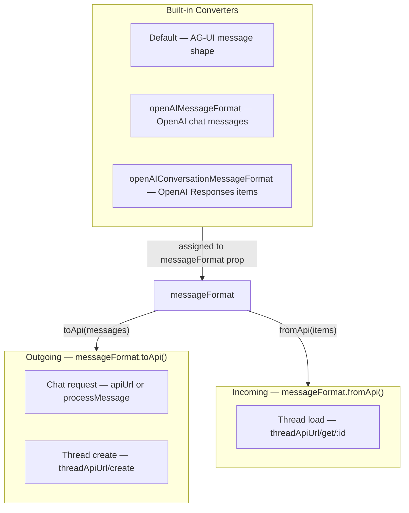

OpenUI Chat can work with any backend stack as long as the API contract is respected.

This page is the reference source for request and response shapes. Use [Connecting to LLM](/docs/chat/connecting) for decision guidance and [Connect Thread History](/docs/chat/persistence) for the setup flow.

## Chat endpoint contract

When you pass `apiUrl`, OpenUI sends a `POST` request with this shape:

```json
{
  "threadId": "thread_123",
  "messages": [{ "id": "msg_1", "role": "user", "content": "Hello" }]
}
```

- `threadId` is the selected thread ID when persistence is enabled, or `"ephemeral"` when no thread storage is configured.
- `messages` is converted through `messageFormat.toApi(messages)` before the request is sent.

If your backend already accepts the default AG-UI message shape, each message can stay in this form:

```json
{ "id": "msg_1", "role": "user", "content": "Hello" }
```

### Stream response

Your response stream must match one of these cases:

| Backend response shape                   | Frontend config                                  |
| :--------------------------------------- | :----------------------------------------------- |
| OpenUI Protocol                          | No `streamProtocol` needed                       |
| Raw OpenAI Chat Completions SSE          | `streamProtocol={openAIAdapter()}`               |
| OpenAI SDK `toReadableStream()` / NDJSON | `streamProtocol={openAIReadableStreamAdapter()}` |
| OpenAI Responses API                     | `streamProtocol={openAIResponsesAdapter()}`      |

## Default thread API contract

When using `threadApiUrl="/api/threads"`, OpenUI expects the base URL plus these default path segments:

| Action        | Method   | URL                       | Request body   | Response                                  |
| :------------ | :------- | :------------------------ | :------------- | :---------------------------------------- |
| List threads  | `GET`    | `/api/threads/get`        | —              | `{ threads: Thread[], nextCursor?: any }` |
| Create thread | `POST`   | `/api/threads/create`     | `{ messages }` | `Thread`                                  |
| Update thread | `PATCH`  | `/api/threads/update/:id` | `Thread`       | `Thread`                                  |
| Delete thread | `DELETE` | `/api/threads/delete/:id` | —              | empty response is fine                    |
| Load messages | `GET`    | `/api/threads/get/:id`    | —              | message array in your backend format      |

`messages` in the create request is the first user message, already converted through `messageFormat.toApi([firstMessage])`.

## Thread shape

```ts
type Thread = {
  id: string;
  title: string;
  createdAt: string | number;
};
```

## Message format contract

`messageFormat` controls both directions:

- `toApi()` shapes the `messages` array sent to `apiUrl` and `threadApiUrl/create`
- `fromApi()` shapes the array returned from `threadApiUrl/get/:id`

OpenUI ships with these built-in message converters:

| Converter                         | Use when your backend expects or returns... |
| :-------------------------------- | :------------------------------------------ |
| Default                           | AG-UI message objects                       |
| `openAIMessageFormat`             | OpenAI chat completion messages             |
| `openAIConversationMessageFormat` | OpenAI Responses conversation items         |

Every persisted message should include a unique `id`. Without stable message IDs, history hydration and message updates become unreliable.

## Example custom converter

```ts
const myCustomFormat = {
  toApi(messages) {
    return messages.map((message) => ({
      speaker: message.role,
      text: message.content,
    }));
  },
  fromApi(items) {
    return items.map((item) => ({
      id: item.id,
      role: item.speaker,
      content: item.text,
    }));
  },
};
```



## Related guides

- [Next.js Implementation](/docs/chat/nextjs)
- [Connect Thread History](/docs/chat/persistence)
- [Providers](/docs/chat/providers)
