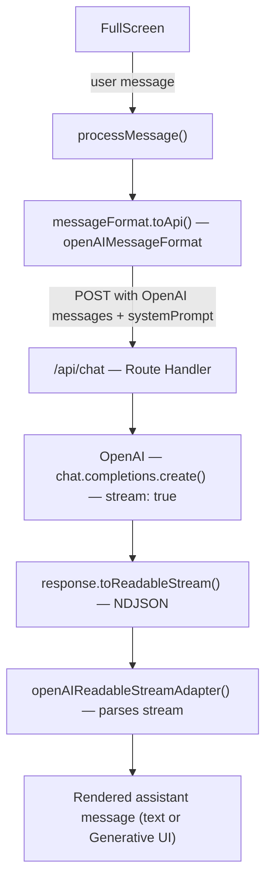

This page covers the Route Handler pattern and matching frontend configuration for a Next.js App Router setup.

If you want the full install-and-render walkthrough, use the [End-to-End Guide](/docs/chat/from-scratch) instead.

This page focuses on one specific backend pattern:

- `processMessage` on the frontend to send messages
- `openAIMessageFormat` to send OpenAI chat messages
- `openAIReadableStreamAdapter()` because `response.toReadableStream()` emits NDJSON, not raw SSE
- the system prompt stays on the server, generated at build time by the CLI

## Route handler

Generate the system prompt at build time:

```bash
npx @openuidev/cli generate ./src/library.ts --out src/generated/system-prompt.txt
```

Create `app/api/chat/route.ts`:

```ts
import { readFileSync } from "fs";
import { join } from "path";
import { NextRequest } from "next/server";
import OpenAI from "openai";

const client = new OpenAI();
const systemPrompt = readFileSync(join(process.cwd(), "src/generated/system-prompt.txt"), "utf-8");

export async function POST(req: NextRequest) {
  try {
    const { messages } = await req.json();

    const response = await client.chat.completions.create({
      model: "gpt-5.2",
      messages: [{ role: "system", content: systemPrompt }, ...messages],
      stream: true,
    });

    return new Response(response.toReadableStream(), {
      headers: {
        "Content-Type": "text/event-stream",
        "Cache-Control": "no-cache, no-transform",
        Connection: "keep-alive",
      },
    });
  } catch (err) {
    console.error(err);
    const message = err instanceof Error ? err.message : "Unknown error";
    return new Response(JSON.stringify({ error: message }), {
      status: 500,
      headers: { "Content-Type": "application/json" },
    });
  }
}
```

The system prompt is loaded from the file generated by the CLI. It never leaves the server.

## Matching frontend configuration

Because `toReadableStream()` produces newline-delimited JSON, pair it with `openAIReadableStreamAdapter()` on the frontend.

When using `processMessage`, you must convert messages yourself with `openAIMessageFormat.toApi(messages)` before sending. The `messageFormat` prop only applies automatically for the `apiUrl` flow.

```tsx
import { openAIMessageFormat, openAIReadableStreamAdapter } from "@openuidev/react-headless";
import { FullScreen } from "@openuidev/react-ui";
import { openuiLibrary } from "@openuidev/react-ui/genui-lib";

<FullScreen
  processMessage={async ({ messages, abortController }) => {
    return fetch("/api/chat", {
      method: "POST",
      headers: { "Content-Type": "application/json" },
      body: JSON.stringify({
        messages: openAIMessageFormat.toApi(messages),
      }),
      signal: abortController.signal,
    });
  }}
  streamProtocol={openAIReadableStreamAdapter()}
  componentLibrary={openuiLibrary}
  agentName="Assistant"
/>;
```

Use `openAIAdapter()` only if your backend emits raw SSE chunks instead of the OpenAI SDK readable stream.



## Related guides

- [Connecting to LLM](/docs/chat/connecting)
- [Providers](/docs/chat/providers)
- [End-to-End Guide](/docs/chat/from-scratch)
