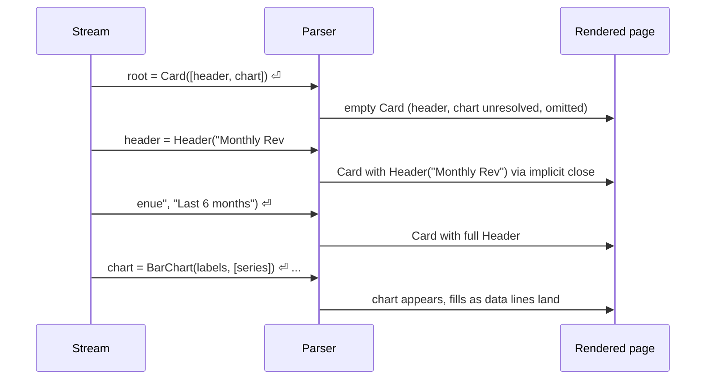
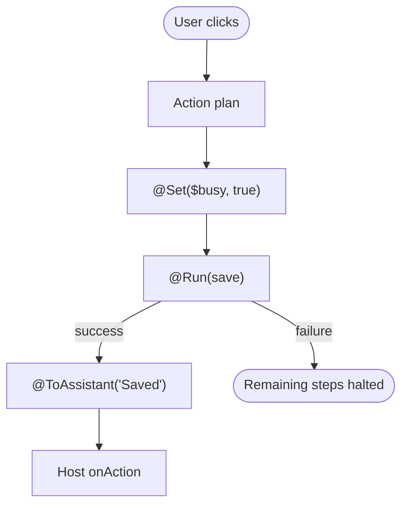
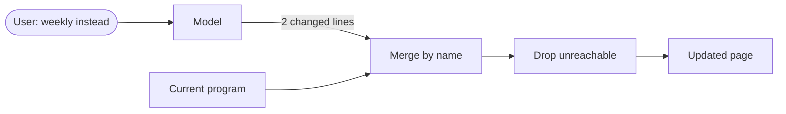
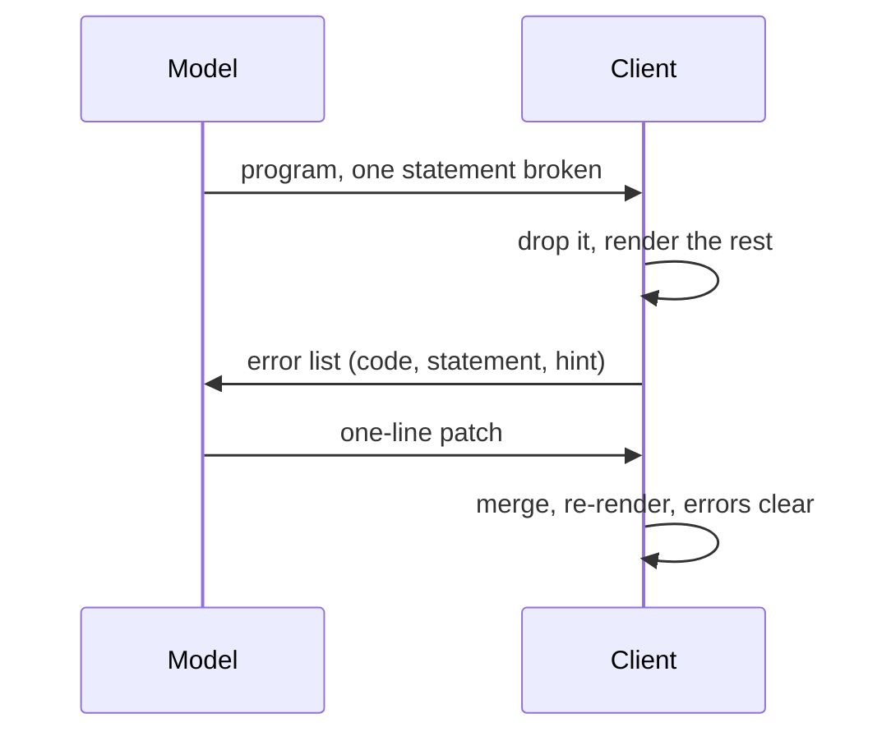

# The OpenUI Language

**1.0-beta, community review draft**

The exact rules of OpenUI Lang. Start with [overview.md](./overview.md) for the guided tour; [prompt.md](./prompt.md) covers what is sent to the model. MUST, MUST NOT, SHOULD, and MAY are used as in RFC 2119, and *(proposed)* marks designed but unshipped behavior.

Three words used throughout: the **generator** is whatever writes OpenUI Lang, in practice a model. The **client** parses and renders it. The **host** is the application embedding the client.

## 1. Grammar

### 1.1 Notation

The grammar is given in EBNF. `=` defines a production, `|` separates alternatives, `[ ]` marks an optional part, `{ }` marks zero or more repetitions, `( )` groups, and terminals appear in double quotes. Lexical tokens (`identifier`, `state_name`, `string`, `number`, `newline`) are defined in prose with patterns in section 1.3; syntactic productions build on them. The complete grammar is collected in section 1.6.

### 1.2 Source text

Before parsing, the input text is preprocessed in order:

1. **Fence extraction.** If the input contains fenced code blocks (three backticks, with or without a language tag), the contents of all fences are extracted and joined with newlines; text outside fences is ignored by the parser (in inline mode, where the model mixes prose with fenced code, it is treated as prose for the conversation). Backtick sequences inside double-quoted strings do not open or close fences; single-quoted strings do not shield them. Comment stripping runs after extraction, so backtick runs inside comments do open and close fences. An unterminated fence extends to the end of the input, which keeps extraction stable while a fence is still streaming. *(proposed)* A host that adopts the multi-library segments engine ([overview.md](./overview.md), section 4.6) supersedes this joined extraction: only fences whose info string starts with `openui-lang` are programs, each fence is its own program, and a fence tagged `text` stays prose. Single-segment hosts keep the joined behavior above.
2. **Comment stripping.** `//` and `#` begin a comment that runs to the end of the line. Comment markers inside string literals are not comments, and string state carries across lines, so a marker inside a multi-line string is preserved.
3. Leading and trailing whitespace of the whole extracted text is trimmed.

### 1.3 Lexical elements

#### Identifiers

Identifiers match `[a-zA-Z_][a-zA-Z0-9_]*`. The first letter carries meaning: an identifier starting with an uppercase letter is a component name; starting with a lowercase letter or underscore, a reference.

```ebnf
identifier    = ( letter | "_" ) { letter | digit | "_" } ;
state_name    = "$" identifier ;
function_name = "@" identifier ;
```

`$` followed by an identifier is a state variable; the `$` is part of the name. `@` followed by an identifier is a built-in or registered function call. The `$` and `@` prefixes are reserved: clients MUST NOT assign other meanings to them.

#### Keywords

The keyword literals are `true`, `false`, and `null`. There are no other keywords.

#### Predeclared and reserved names

The full set of names the language claims for itself:

| Group | Names |
| --- | --- |
| Keyword literals | `true`, `false`, `null` |
| Reserved call forms | `Query`, `Mutation`, `Action` |
| Built-in functions | `@Count`, `@First`, `@Last`, `@Sum`, `@Avg`, `@Min`, `@Max`, `@Filter`, `@Sort`, `@Round`, `@Abs`, `@Floor`, `@Ceil`, `@Each` |
| Action steps | `@Set`, `@Reset`, `@Run`, `@ToAssistant`, `@OpenUrl`, declared actions *(proposed)* |
| State prefix | every `$name` |

`Query` and `Mutation` are statement forms and `Action` is an expression form (section 2.1); none of the three is a component. Built-in semantics are in section 3.4, action steps in section 6.3. Registered functions *(proposed)* extend the `@` namespace; libraries MUST NOT shadow built-ins or define components with reserved names ([prompt.md](./prompt.md), library rules).

#### Operators and punctuation

```text
=  ==  !=  >  <  >=  <=  +  -  *  /  %  &&  ||  !  ?  :  .  ,  (  )  [  ]  {  }
```

A single `&` or `|` is accepted with the meaning of `&&` or `||`.

#### String literals

Strings are double-quoted or single-quoted. Double-quoted strings use JSON escape sequences (`\n`, `\t`, `\"`, `\\`, `\uXXXX`). Single-quoted strings support only `\'`, `\\`, `\n`, `\t`; any other escaped character is kept as the bare character. An unterminated string at the end of a streaming buffer is closed implicitly (section 4).

#### Number literals

Numbers match `-?[0-9]+(\.[0-9]+)?([eE][+-]?[0-9]+)?`. An `e` or `E` after the digits is consumed as an exponent marker even when no digits follow it; the resulting token is not a usable number. A `-` starts a number literal only when the previous token is not a value (not a literal, reference, closing parenthesis, closing square bracket, or call; a closing brace does not count) and the next character is a digit; otherwise it is the subtraction or negation operator. With optional commas this matters: `[1 -2]` is one element, the subtraction `1 - 2`; a generator that means two elements writes the comma. A `.` is part of a number only when a digit follows; `1.` is the number `1` followed by member access.

#### Whitespace and other characters

Spaces and tabs separate tokens. The `newline` token is `\n`; an immediately preceding `\r` is consumed with it, so CRLF input lexes identically. A newline ends a statement when it occurs at bracket depth zero (section 1.4). Any character that matches no rule is skipped as if it were whitespace (`a;b` lexes as the two tokens `a`, `b`); lexing never fails.

### 1.4 Statements

A program is a sequence of statements:

```ebnf
program   = statement { newline statement } ;
statement = ( identifier | state_name ) "=" expression ;
```

The left side is a reference name, a component name, or a state variable. A line that does not have this shape is skipped without error in the default mode; in strict mode *(proposed)* it MUST produce an `invalid-statement` diagnostic.

A statement continues past a newline in three cases:

1. The newline occurs inside unclosed `(`, `[`, or `{`.
2. The newline occurs inside an unterminated string literal; strings may contain raw newlines.
3. The newline occurs while a ternary is open at bracket depth zero, or the first non-whitespace token of the following line is `?`. This lets a ternary span lines. A ternary is **open** from its `?` until the first complete operand after its matching `:` has been consumed; a newline arriving while either branch is still empty continues the statement.

These three rules are the complete definition of a statement boundary. Both the batch parser and the streaming parser MUST agree on them byte for byte. Because rule 3 depends on the following line, a statement boundary at a newline is provisional during streaming: the statement is complete only once the first non-whitespace character of the next line has arrived and is known not to be `?` (section 4, rule 1).

### 1.5 Expressions

#### Operands

```ebnf
primary = literal | array | object | call | reference | "(" expression ")" ;
literal = string | number | "true" | "false" | "null" ;
array   = "[" [ arguments ] "]" ;
object  = "{" [ key ":" expression { [ "," ] key ":" expression } ] "}" ;
reference = identifier | state_name ;
```

Object keys may be names, strings, numbers, component names, or `$`-prefixed names (the `$` is stripped), and are read as strings; any other token is read as the key `?`. `name` denotes a lowercase-initial identifier; `ComponentName` an uppercase-initial one. A bare identifier of either case in operand position is a reference: hoisting is case-blind, and only the call-head position gives an uppercase identifier component meaning.

Inside an expression, `$name = expression` parses as a binding assignment, the form the runtime uses for two-way binding. Generators are not taught this form and SHOULD NOT produce it.

#### Calls

```ebnf
call      = ( ComponentName | function_name ) "(" [ arguments ] ")" ;
arguments = expression { [ "," ] expression } ;
```

Commas between call arguments, array elements, and object entries are optional separators, and trailing commas are ignored. `function_name` is defined in section 1.3; the identifier after `@` is conventionally uppercase, matching the built-ins, and the grammar accepts either case. Built-ins require the `@` prefix: `Count(x)` without `@` is not a call, it parses as the bare reference `Count`, and the arguments are lost. Generators are taught the prefix; clients SHOULD surface a diagnostic *(proposed)* when an uppercase call matches a built-in name without `@`.

#### Member access and indexing

```ebnf
postfix = primary { "." field | "[" expression "]" } ;
```

Member-access fields accept the same token set as object keys. Only component names and `@` names head calls; a member access is never callable (`foo.bar(x)` is not a call form).

#### Operators and precedence

Precedence from lowest to highest; binary operators are left-associative:

1. `? :` (ternary, right-associative)
2. `||`
3. `&&`
4. `==` `!=`
5. `>` `<` `>=` `<=`
6. `+` `-`
7. `*` `/` `%`
8. unary `!` and `-` (they stack: `!!x` is valid)
9. postfix: member access and indexing (calls are primary forms, not postfix operators)

### 1.6 Complete grammar

```ebnf
program        = statement { newline statement } ;
statement      = ( identifier | state_name ) "=" expression ;
expression     = ternary ;
ternary        = or [ "?" ternary ":" ternary ] ;
or             = and { "||" and } ;
and            = equality { "&&" equality } ;
equality       = comparison { ( "==" | "!=" ) comparison } ;
comparison     = additive { ( ">" | "<" | ">=" | "<=" ) additive } ;
additive       = multiplicative { ( "+" | "-" ) multiplicative } ;
multiplicative = unary { ( "*" | "/" | "%" ) unary } ;
unary          = { "!" | "-" } postfix ;
postfix        = primary { "." field | "[" expression "]" } ;
primary        = literal | array | object | call | reference
               | "(" expression ")" ;
call           = ( ComponentName | function_name ) "(" [ arguments ] ")" ;
arguments      = expression { [ "," ] expression } ;
array          = "[" [ arguments ] "]" ;
object         = "{" [ key ":" expression { [ "," ] key ":" expression } ] "}" ;
literal        = string | number | "true" | "false" | "null" ;
reference      = identifier | state_name ;
```

The lexical tokens and the token sets for `key` and `field` are defined in sections 1.3 and 1.5.

A few corners are implementation-defined until the conformance fixtures pin them: trailing tokens after a complete expression in one statement, the value of a number token with a dangling exponent, partially received unicode escapes under implicit closing (section 4), and whether an unchanged query re-fetches after a merge (section 7).

## 2. Program model

### 2.1 Statement kinds

Each statement is classified by its right side, in this order:

1. `Query(...)` at the top level: a **query statement**.
2. `Mutation(...)` at the top level: a **mutation statement**.
3. Left side is a `$` variable: a **state declaration**; the right side is its default value.
4. Anything else: a **value statement** (components, literals, derived expressions).

The order matters: `$x = Query(...)` is a query whose id is `$x`, not a state declaration. `Query` and `Mutation` are valid only as the entire right side of a statement. Two terms recur in the rules that follow: a **value position** is a direct argument of a component call or a direct element of an array literal, before any operator applies; a **computed expression** is any other expression context (an operand of an operator, a ternary branch, an object value). `Query` and `Mutation` used in a value position produce an `inline-reserved` error and evaluate to nothing; nested inside a computed expression they evaluate to null, currently without the error. `Action(...)` is an ordinary expression, not a statement kind: it may appear inline in a component argument or be bound to its own statement and referenced from one.

### 2.2 Entry resolution

A program's entry SHOULD be a statement named `root` whose value is a single component call, and generated prompts teach exactly that form. The fallback chain below exists as error recovery for a generator that forgot; it is not an alternative authoring style.

When no statement is named `root`, clients MUST recover by choosing the entry in this order, so that recovery renders identically everywhere:

1. The statement whose name equals the library's root component name.
2. The first value statement whose component call matches the library's root component.
3. The first value statement that is a component call.
4. The first statement.

If the chosen entry does not resolve to a component, nothing renders and the client reports it once the stream is complete (a dedicated `no-root` code is proposed; the reference client currently reports `parse-failed`). During streaming, an absent root is not an error; the program may not have arrived yet.

*(proposed)* 1.0-beta simplifies recovery to a pure function of the program text: steps 1 and 2 are dropped, so the chosen entry never depends on which library renders the text, and the fallback is the first value statement that is a component call. A program recovered this way renders and reports a non-fatal `no-root`, teaching the generator to name its entry. A program with no component statement at all reports `no-root` with nothing rendered, and a `root` bound to a non-component recovers the same way, with a hint that `root` must be a component.

*(proposed)* `createLibrary` requires the `root` field, and it accepts one component name or several (`root: ["Card", "Dashboard"]`), letting the model pick the right top level per request. The field guides prompt generation only; under the simplified recovery above, entry resolution never consults it, so what renders is always decided by the program text.

### 2.3 Reference resolution and hoisting

A bare name in an expression refers to the statement with that name, wherever it appears in the program. Statements form a graph, not a sequence. Resolution rules:

- A reference to a statement that does not exist is **unresolved**. Unresolved references are recorded in the parse metadata, not reported as errors, because during streaming they usually mean "not yet".
- An unresolved reference evaluates as null in an expression and renders nothing in a component position. During streaming, clients SHOULD NOT surface required-prop errors caused only by unresolved references; when the stream ends, the rules of section 8.4 apply.
- A reference that participates in a cycle is unresolved at the point that closes the cycle.
- A statement referenced from two places is evaluated independently at each site. Shared references are copies, not instances; copies duplicate only the tree, and the single page state store is shared. Runtime results are the exception: a query referenced twice still fetches once, and both sites read the same result.
- References to query or mutation statements resolve to their runtime results (section 6), not to the statements themselves.

Value statements not reachable from the entry are **orphans**, reported in parse metadata and not rendered. State, query, and mutation statements are never reported as orphans, and a query statement executes whether or not it is reachable from the entry (section 6.1).

### 2.4 Duplicate names

If two statements bind the same name, the later one wins. During streaming, a pending parse never replaces a completed statement (section 4, rule 3). One exception to later-wins: when a mutation and a query bind the same name, references to that name resolve to the mutation result (section 6.2). The names the language reserves are listed in section 1.3; the rules libraries must follow around them live in [prompt.md](./prompt.md).

## 3. Evaluation

### 3.1 Values and coercion

Values are strings, numbers, booleans, null, arrays, objects, and component instances. Numeric coercion (`toNumber`) is used by arithmetic and comparisons: a number is itself; a string converts via number parsing, or 0 if it does not parse, so NaN never enters the value domain; `true` is 1 and `false` is 0; everything else is 0. Truthiness follows JavaScript ToBoolean; arrays, objects, and component instances are truthy. A component instance in an expression behaves like an object: `toNumber` 0, truthy, member access yields null.

For cross-platform determinism, string-to-number parsing, loose equality, and number-to-string formatting follow the JavaScript algorithms (ECMA-262 ToNumber, IsLooselyEqual, and Number::toString); non-JavaScript clients MUST reproduce them, and the fixture suite exercises them.

### 3.2 Operators

- `+`: if either operand is a string, string concatenation, with null and undefined becoming the empty string (so `"Total: " + missing` is `"Total: "`, never `"Total: null"`). Otherwise numeric addition via `toNumber`.
- `-`, `*`: numeric via `toNumber`.
- `/`, `%`: numeric via `toNumber`; when the divisor is 0 the result is 0, not an error and not Infinity.
- `==`, `!=`: loose equality per IsLooselyEqual (`5 == "5"` is true).
- `>`, `<`, `>=`, `<=`: both sides via `toNumber`.
- `&&`, `||`: short-circuit and return the deciding operand's value, as in JavaScript.
- `!`: negates truthiness. Unary `-` negates `toNumber` of its operand.
- `cond ? a : b`: chooses by truthiness of `cond`.

A value of null in a component position renders nothing. This makes `cond ? panel : null` the conditional rendering idiom. Strings, numbers, and booleans in a component position render as text.

### 3.3 Member access and pluck

`a.b` on an object reads the field. `a.b` on an array plucks: it produces the array of `b` values of every element, with null for elements that lack the field. As a special case, `.length` on an array is its element count. Member access on null is null. `a[i]` indexes arrays by number and objects by string key; a null object or index gives null.

### 3.4 Built-in function reference

| Built-in | Signature | Semantics |
| --- | --- | --- |
| `@Count` | `(array) → number` | Element count; 0 for non-arrays. |
| `@First`, `@Last` | `(array) → value` | First or last element; null for empty or non-arrays. |
| `@Sum` | `(array) → number` | Sum via `toNumber`; 0 for non-arrays. |
| `@Avg` | `(array) → number` | Mean via `toNumber`; 0 for empty or non-arrays. |
| `@Min`, `@Max` | `(array) → number` | Minimum or maximum via `toNumber`; 0 for empty or non-arrays. |
| `@Filter` | `(array, field, op, value) → array` | Keeps elements whose `field` satisfies `op value`. Ops: `==`, `!=` (loose), `>`, `<`, `>=`, `<=` (numeric), `contains` (case-sensitive substring of the stringified field). An empty or absent `field` tests the elements themselves; an absent op defaults to `==`; a present but unrecognized op matches nothing. Empty array for non-arrays. |
| `@Sort` | `(array, field, direction?) → array` | Stable sort on `field` (empty string sorts the elements themselves). Pairs where both sides are numeric compare numerically; otherwise as locale-compared strings, so identical programs can sort differently across platforms until the pinned collation lands (proposed: code-point order, fixed by the fixture suite). Descending only when the third argument is `"desc"`. Returns the input unchanged for non-arrays. |
| `@Round` | `(number, decimals?) → number` | Round to `decimals` places, default 0, with JavaScript `Math.round` semantics (half rounds toward positive infinity). |
| `@Abs`, `@Floor`, `@Ceil` | `(number) → number` | Via `toNumber`. |
| `@Each` | `(array, varName, template) → array` | Section 3.5. |

Field arguments accept dot paths (`"customer.name"`).

### 3.5 Iteration with `@Each`

`@Each(array, varName, template)` evaluates `template` once per element with `varName` bound to the element. The loop variable exists only inside the template and shadows a statement of the same name there; a nested `@Each` reusing the same `varName` shadows the outer binding. No index variable is provided. The element's value is substituted into the template before deferred evaluation, so an action inside the template captures the element it was created with:

```openui-lang
rows = @Each(tickets, "t", Row(t.title, Button("Close", Action([@Run(close), @Set($selected, t.id)]))))
```

### 3.6 Purity requirements

Registered functions and validators MUST be pure and deterministic. The runtime MAY cache their results and MAY invoke them any number of times in any order. Anything that needs application state or produces effects belongs in an action handler, not a function.

## 4. Streaming

A client MUST accept input incrementally and produce a valid render after every chunk. The rules:

1. **Statement completion.** A statement is complete when its terminating newline (per section 1.4) has arrived and the continuation rules cannot extend it; for the ternary rule this means the first non-whitespace character of the following line has arrived and is not `?`. Completed statements are parsed once and their results are stable across subsequent chunks.
2. **The pending tail.** The text after the last completed statement is parsed on every chunk after implicit closing: an unterminated string is closed (with a `\` appended first if the text ends mid-escape), then unclosed brackets are closed in reverse order of opening. Mismatched closing brackets are skipped and do not change the bracket stack. A pending statement whose expression still fails to parse after implicit closing is not produced.
3. **Pending never overwrites completed.** A statement parsed from the pending tail is discarded if a completed statement with the same name exists.
4. **Reconciliation.** If preprocessing of the fuller text no longer begins with the previously completed prefix (for example, a fence opener arrives and retroactively changes what the program text is), the client MUST discard its cache and reparse from the start.
5. **No placeholders.** An array element that is an unresolved reference is omitted, not rendered as a hole or skeleton. The element appears when its statement arrives.
6. **Interactive features wait.** Queries and mutations MUST NOT execute while streaming is in progress. State declarations initialize as they arrive, but a default value recovered from a truncated statement MUST be replaced when the full statement arrives, unless the user has already edited that state. *(The reference client does not yet implement this replacement; it is a known defect.)*
7. **The host ends the stream.** The language has no in-band terminator; the host signals end of stream to the client (in the React client, the `isStreaming` prop). The signal finalizes the pending tail: implicit closing applies, and the resulting statements become completed, including a redefinition of an earlier name, which then wins per section 2.4. After finalization the streaming parser's result MUST equal the batch parse of the same bytes. *(The reference streaming parser currently drops a final-line redefinition; known defect.)* Chunks arriving after the signal are a new stream.



## 5. State and forms

### 5.1 The state store

State is a flat map of `$name` to value, scoped to one rendered program. A state declaration provides the default. Any `$name` referenced anywhere without a declaration is auto-declared with default null. Defaults apply only when the variable has no value yet: re-parses during streaming and edits MUST NOT overwrite a value the user has produced. Host-persisted state, when supplied, is applied over defaults at initialization. Keys are never deleted by re-parsing. A query or mutation bound to a `$` name (section 2.1) is classified as a query or mutation, not a state declaration, but expressions cannot reach its result: `$name` always reads the state store, which holds the auto-declared null. Generators SHOULD NOT produce this form.

### 5.2 Two-way binding

Passing a `$variable` as the argument for a prop the library marks as bindable creates a two-way binding: the component displays the current value and writes user changes back. Which props are bindable is part of the component's library definition, not the language; the prompt renders such props as `$binding<type>`, for example `$binding<string>`, so the model knows where state can be attached, and the LibrarySpec marks them with a `bindable` flag *(proposed)* so prompts generated from the spec print them the same way. A `$variable` passed to a non-bindable prop evaluates to its current value.

### 5.3 Form state

Fields group under the nearest enclosing form component, one that provides a form name to its subtree the way the reference library's `Form` does; how a component provides a form name is part of its library definition (a LibrarySpec marker for it is proposed alongside `bindable`). Inputs outside any form write into **page-level state**, the unnamed default scope. Form values persist across re-parses. When an action sends a message to the model, the current form state travels with the event so the model sees what the user entered. Hosts MAY persist form state and restore it when re-rendering a stored program.

### 5.4 Validation rules and named validators

Validation rules are an object argument on input components: `{ required: true, email: true, url: true, numeric: true, minLength: 3, maxLength: 80, min: 0, max: 100, pattern: "^[A-Z]" }`. `pattern` is an ECMAScript regular expression evaluated without flags. Rules other than `required` skip empty values, where empty means null, undefined, the empty string, an empty array, or an object with no keys. The first failing rule produces the field error. A form submits only when every field passes.

Named validators *(proposed)* extend the set: a validator declared in the library joins the rules object as its own key, `{ required: true, corporateEmail: true }`, indistinguishable from a built-in rule. The prompt lists registered names next to the built-ins. Like every rule other than `required`, a custom validator skips empty values; emptiness always belongs to `required`. A rule key that is neither a built-in rule nor a declared validator MUST NOT block the field: the client ignores that rule, applies the remaining rules, and emits an `unknown-validator` diagnostic.

## 6. Data and actions

### 6.1 Query lifecycle

`name = Query(tool, args, defaults, refreshSeconds?)`. Arguments by position: the tool name, the argument object, the default result rendered until data arrives, and an optional refresh interval in seconds.

- A query executes when streaming ends, and again whenever a `$variable` referenced in its `args` changes. Dependencies are the `$variables` written literally in the `args` expression. State reached indirectly, through a referenced statement, is not a dependency and does not trigger a re-fetch; generators are taught to place `$variables` directly in `args`.
- While a re-fetch driven by changed arguments is in flight, the previous result remains visible; the result of a fetch whose arguments are no longer current is discarded.
- References to a query resolve to its latest result, or its defaults before the first result. The reserved keys `__openui_loading`, `__openui_refetching`, and `__openui_errors` expose fetch state on the query result object to the host; they are not readable from expressions.
- A refresh interval re-executes the query on a timer.

### 6.2 Mutation lifecycle

`name = Mutation(tool, args)`. A mutation never runs on load; it runs only through `@Run`. Its `args` are evaluated at invocation time with current state. References to a mutation resolve to `{ status, data, error }`, where `status` is `idle`, `loading`, `success`, or `error`. A mutation whose status is `loading` rejects a second invocation. When a mutation and a query are bound to the same name, references to that name resolve to the mutation result.

### 6.3 Action plans and steps

`Action([step, step, ...])` builds a plan; a component's action prop triggers it. Steps run in order; a mutation run is awaited, while query re-fetches and host events are dispatched without waiting:

- `@Set($var, value)`: evaluates `value` at click time and writes it.
- `@Reset($a, $b, ...)`: restores declared defaults (null if none).
- `@Run(ref)`: runs a mutation, or re-fetches a query. A failed mutation halts the remaining steps.
- `@ToAssistant(message, context?)`: emits a `continue_conversation` event to the host, carrying the message, an optional context string in `params.context`, and the current form state.
- `@OpenUrl(url)`: emits an `open_url` event to the host.

`@Run`, `@Set`, and `@Reset` name their targets rather than evaluate them: `@Run` takes a reference to a query or mutation statement, `@Set` takes the state variable itself, and `@Reset` takes state variables. The template argument of `@Each` is deferred the same way (section 3.5). `@Run` on a query requests a re-fetch and never halts the plan; only a failed mutation halts.

Components MAY define a default action; the reference library's button with no action emits `continue_conversation` with its label as the message. Events cross to the host in one field set. `formName` is the name of the nearest form enclosing the triggering component, absent otherwise, and form field values travel in the store shape, each wrapped as an object with `value` and `componentType` keys:

```json
{ "type": "continue_conversation",
  "humanFriendlyMessage": "Ticket closed",
  "params": { "context": "..." },
  "formName": "ticket",
  "formState": { "ticket": { "status": { "value": "closed", "componentType": "input" } } } }
```

`open_url` events carry the same field set with `params.url` and an empty `humanFriendlyMessage`. Custom action events *(proposed)* carry the declared action name as the event type and the validated arguments as `params` (section 6.4).



### 6.4 Custom actions *(proposed)*

An action declared in the library with `defineAction` is invoked as a named step, exactly like a built-in: `@ApproveInvoice("inv_42")`. Positional arguments map to the declaration's params schema by key order, the same rule component calls follow, and the client validates them against that schema before dispatching. The step then dispatches to the host through the same action-event channel the built-in effect steps use, with the action name as the event type and the validated arguments as its params; implementations stay host-side and never serialize. An unknown name in action-step position emits an `unknown-action` diagnostic and only that step is skipped; the remaining steps run, and the plan MUST NOT halt silently.

### 6.5 Tool resolution

The host supplies tools as a map of async functions keyed by tool name, or as an MCP client. Tool names are case-sensitive. A tool that is not found fails the query or mutation with `tool-not-found` and a hint listing available tools; it MUST NOT crash the host application.

## 7. Incremental editing

In edit mode the model receives the current program with the conversation and responds with only the statements that change. The client merges by statement name:

- A patch statement whose name exists replaces the original.
- A new name appends.
- Names absent from the patch are kept.
- `name = null` deletes the statement.
- After merging, statements no longer reachable from the `root` statement are removed; a program with no statement named `root` is not garbage collected. State declarations are always kept.

The parser does not treat `name = null` specially: inside one program it is an ordinary binding and later-wins applies. Deletion is the merge routine's interpretation of a top-level `name = null` in a patch, and the host decides when a text is merged as a patch rather than parsed as a program. A state declaration assigned null in a patch has its default set to null; the key is kept.

Merging composes with streaming through the streaming parser, which applies each patched line as it completes; merging two complete texts is a batch operation. Inline mode composes with editing: the model may reply with prose plus a fenced patch, and only the fenced part is merged.



## 8. Errors and recovery

### 8.1 Drop and render

The invariant behind every rule in this section: **a mistake removes the smallest possible unit, and everything else renders.** An invalid argument degrades the prop, an invalid component drops that component, an invalid statement drops that statement. Nothing a model can emit crashes the client, and every removal is reported.

### 8.2 Error codes

| Code | Source | Meaning | Recovery |
| --- | --- | --- | --- |
| `unknown-component` | parser | Component not in the library | Statement dropped (see 8.4 for computed-expression positions) |
| `missing-required` | parser | Required prop absent | Filled from schema default if present, else component dropped |
| `null-required` | parser | Required prop is null | Same as missing |
| `excess-args` | parser | More arguments than props | Extras dropped, component renders |
| `inline-reserved` | parser | `Query`/`Mutation` in a value position | Expression evaluates to nothing |
| `parse-failed` | parser | Response yielded no renderable program | Nothing renders |
| `invalid-statement` *(proposed)* | parser | Line is not a valid statement (strict mode) | Line skipped |
| `parse-exception` | parser | Parser failure | Nothing renders; MUST be caught |
| `no-root` *(proposed)* | parser | No statement named `root`, or `root` is not a component call (stream complete) | Non-fatal when a component statement is recovered as the entry (section 2.2); nothing renders when none exists. Reported as `parse-failed` today |
| `runtime-error` | runtime | Expression evaluation threw | Prop falls back to the value as parsed, unevaluated |
| `render-error` | runtime | Component renderer threw | Contained; last successful render kept |
| `tool-not-found` | query/mutation | Unknown tool name | Query keeps defaults; hint lists tools |
| `tool-error`, `mcp-error` | query/mutation | Tool invocation failed | Mutation result carries the error; a query keeps defaults or last good data |
| `unknown-function` *(proposed)* | parser | `@Name` in expression position is neither built-in nor registered | Statement dropped |
| `unknown-action` *(proposed)* | parser | Step name in an action plan is neither built-in nor declared | Only that step skipped; remaining steps run |
| `unknown-validator` *(proposed)* | parser | Rule key is neither a built-in rule nor a declared validator | That rule ignored; remaining rules apply |
| `constraint-violation` *(proposed)* | parser | Argument violates a schema constraint ([prompt.md](./prompt.md), section 3) | Value renders as-is; warning-level diagnostic, MUST NOT drop the component |

### 8.3 The error object

Errors cross the wire in one shape, designed to be pasted into a model conversation:

```json
{
  "source": "parser",
  "code": "missing-required",
  "statementId": "chart",
  "component": "BarChart",
  "path": "/labels",
  "message": "Missing required prop labels",
  "hint": "Signature: BarChart(labels*, series*, variant) — * marks required"
}
```

`hint` carries a compact signature built from the JSON Schema, prop names only with required props starred, or the available options when the problem is an unknown name. The reference client emits the error list when a completed render produces a different list than the last emission; clients MUST NOT re-emit an unchanged error list and MUST signal recovery by emitting an empty list.



### 8.4 Component validation rules

Arguments map to props positionally against the library schema. Validation then runs per prop: a missing or null required prop uses the schema default when one exists, otherwise the component is invalid and is dropped. Excess arguments are dropped with a diagnostic while the component still renders. Inside arrays, invalid components and unresolved references are omitted; explicit `null` literals are kept (and render nothing). Unknown components in a value position are dropped; inside a computed expression they are kept in the tree so the error can point at them, but they render nothing.

## 9. The program tree and serialization

### 9.1 The tree

Parsing produces a tree: each statement's name and kind, and for component calls the component type with arguments mapped to named props against the schema. The tree, not the text, is what evaluation and rendering consume. A canonical JSON interchange shape for this tree is under exploration and not part of this specification; it would give hosts a schema-independent storage format and give the conformance fixtures their expected-output format.

### 9.2 Serialization

A rendered tree serializes back to source text: each component with a statement name becomes a statement, children are emitted before their parents, props emit positionally in schema order with `null` holding unfilled required positions, and trailing nulls for optional props are trimmed. Object keys serialize unquoted, so keys must be valid names to round-trip. Serialization is currently defined for component trees only; query, mutation, and state statements have no serialization rules yet and do not round-trip. Serialization output SHOULD reparse to a tree equivalent up to the recovery rules of section 8, and serializers SHOULD parenthesize nested expressions whenever the reparse would otherwise change grouping; the reference serializer currently parenthesizes only lower-precedence binary children, so expressions like `a - (b - c)` and `-(a + b)` do not yet round-trip.

## 10. Client checklist

A conforming client:

- MUST parse the complete grammar of section 1, including features it does not implement, and drop the statements that depend on a missing feature rather than failing.
- MUST re-render correctly after every streamed chunk and follow all seven rules of section 4.
- MUST apply the recovery table of section 8 exactly: same drops, same fallbacks.
- MUST NOT let any generated content crash the host application, including component renderers that throw.
- MUST report errors in the wire shape of section 8.3 and clear them on recovery.
- MUST resolve tools case-sensitively and, when custom actions ship, validate dispatch payloads against declared schemas.
- MUST keep user-entered state across re-parses and edits.
- SHOULD provide hooks for unknown components and actions so hosts can render diagnostics instead of blank space.
- MAY pace the visual reveal of streamed content, provided parsing itself follows section 4.

## Appendix A. A worked streamed example

The response arrives in four chunks. After each chunk, the client state:

**Chunk 1**: `root = Card([header, kpis])\nheader = Head`
Parse: one completed statement (`root`); the pending tail parses as `header` bound to the bare reference `Head`. Render: an empty Card. `Head` and `kpis` are unresolved.

**Chunk 2**: `er("Tickets", "Today")\nkpis = Stack([open`
Parse: `header` completes. Pending: `kpis = Stack([open` autocloses to `Stack([open])`; `open` unresolved, omitted. Render: Card with Header, empty Stack.

**Chunk 3**: `, closed])\nopen = Metric("Open", @Count(@Filter(tickets.rows, "status", "==", "open")))\n`
Parse: `kpis` and `open` complete. `closed` and `tickets` unresolved. Render: Card, Header, Stack with one Metric (its count is 0 until `tickets` arrives).

**Chunk 4**: `closed = Metric("Closed", 8)\ntickets = Query("listTickets", {}, { rows: [] })\n`
Parse: complete; stream ends; the query executes and the metrics recompute. Render: the full dashboard, live.

Every intermediate frame was a valid page. The client showed no errors and no placeholders.

## Appendix B. Conformance fixtures

A conformance fixture suite is planned to accompany this specification: pairs of input program and expected parse result (rendered tree, metadata, errors), plus streaming fixtures given as chunk sequences with the expected state after each chunk. A client claims conformance against a tagged fixture release. The fixtures are the operational definition of this document: where prose and fixtures disagree, that is a specification bug, and the next tagged release fixes both.

## Appendix C. Changelog

- **2026-08-12**: Fixes from three independent review passes. Grammar: the call production uses `function_name` (either case after `@`), `reference` admits bare identifiers of either case, matching the prose and Appendix A. Streaming: end-of-stream finalizes the pending tail with batch-parse equality required (rule 7); "open ternary" defined precisely (1.4). Entry: the required `root` field and its array form stated (2.2). Fence extraction gains the segments-engine supersession note (1.2); `newline` pinned with CRLF tolerance (1.3); `constraint-violation` added to the error table (8.2); Appendix A example corrected to `tickets.rows`.
- **2026-08-05**: Draft renamed from 0.9 to 1.0-beta; earlier entries keep the old name.
- **2026-08-04**: Proposed designs sharpened after a second review round: entry recovery proposed as a pure function of the program text with a non-fatal `no-root` (2.2); custom actions became direct named steps dispatched through the existing action-event channel (6.4); named validators became rules-object keys (5.4); the `unsupported-feature` code was withdrawn; error-table recoveries made per-code (8.2).
- **2026-08-03**: Grammar restructured with notation, lexical elements, and predeclared names up front; conformance profiles removed (the parse-everything rule moved into the client checklist); draft split into overview, language, and prompt documents. Review fixes from four review passes: grammar corrections (state-name statements, stacked unary, underscore in identifiers, binding assignments), streaming boundary made precise for ternary continuation, unresolved-reference evaluation specified, orphan and event wire shapes corrected to shipped behavior, validator list completed, terminology defined (value position, computed expression, page-level state).
- **2026-07-22**: First community review draft (0.9). Covers the implemented language plus proposed extensions: registered functions, named validators, custom actions, strict parse mode, and the LibrarySpec registries.
