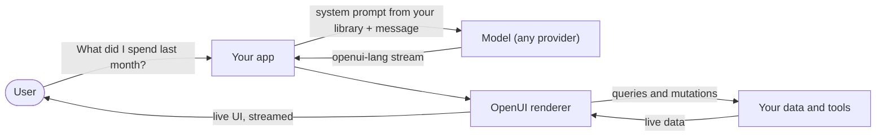
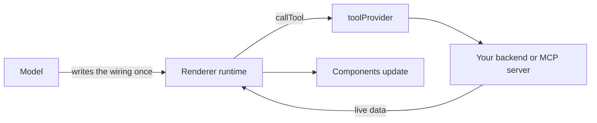
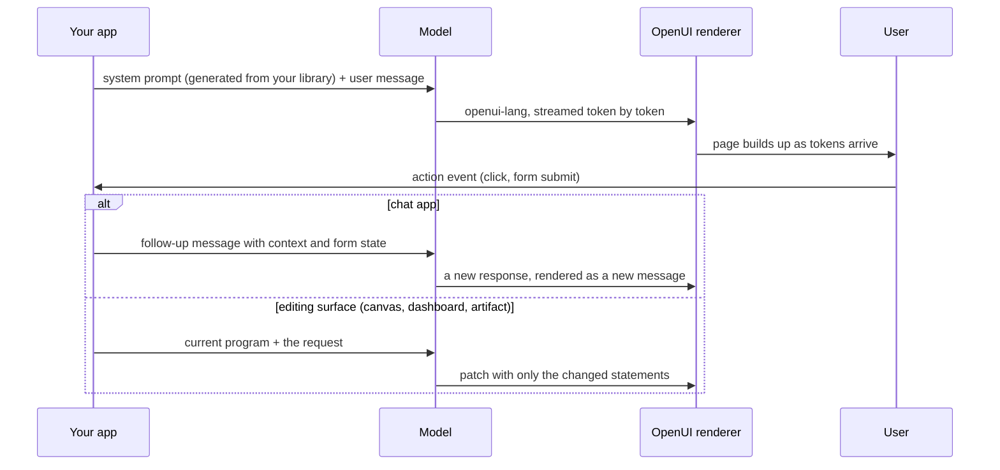
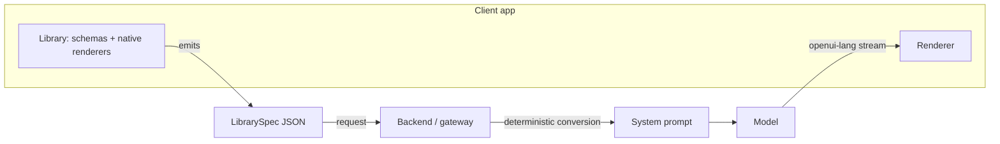

# OpenUI Overview

**1.0-beta, community review draft**

The OpenUI specification is split into three documents:

- **overview.md** (this file): what OpenUI is, its features in detail, and how to build with it.
- **[language.md](./language.md)**: the normative language specification, for client implementers.
- **[prompt.md](./prompt.md)**: the LibrarySpec and everything that is sent to the model.

This is the final specification draft for community review until 1.0. Shipped behavior and proposed extensions are kept apart: sections 1 to 3 describe what works today, and section 4 collects the proposed features, where feedback is especially welcome.

## What's new in 1.0-beta

v0.1 covered the static core (syntax, positional mapping, streaming, hoisting) and v0.5 added the interactive layer (reactive state, built-ins, queries, mutations, actions, prompt flags). 1.0-beta changes no shipped syntax; the one proposed change to shipped behavior is the simplified entry recovery ([language.md](./language.md), section 2.2). The theme of 1.0-beta is running OpenUI in production: making a library yours, shipping more than one surface, and keeping persisted UIs working as your product evolves. These are the proposed additions, each tagged *(proposed)* where it appears:

- **Extending a library.** `library.extend({ add, remove, override })` derives a new library from a base: add your own components to the default library, remove what your product does not use, or override a component with your own. Added components can appear anywhere general content goes, with no extra wiring (section 4.5).
- **Multiple libraries in one response.** Fenced blocks tagged with `library=<id>` let one generation carry programs from different libraries: a chat answer and a slides artifact in one response, each routed to its own surface through the segments API (section 4.6).
- **Library versioning and backward compatibility.** Libraries carry a stable `id` and a `version`, and stored UIs survive library evolution: props can be reordered, removed, or added and persisted pages still render correctly. The mechanism is one metadata line appended to stored messages, carrying the key orders the message was written against, the same writer-schema idea Avro uses for positional data (section 4.7; full protocol in [prompt.md](./prompt.md), section 7). Renames, component successors, and serving older clients a matching library build on the same protocol and are not yet specified.
- **Registered functions.** Libraries declare pure, typed functions the model calls like built-ins: `price = TextContent(@FormatCurrency(total, "USD"))`. Declared with `defineFunction`, advertised in the prompt, implemented in each client (sections 4.1 and 4.2).
- **Named validators.** Custom validation checks join the built-in rules object as their own keys, with no new syntax: `{ required: true, corporateEmail: true }`. Declared with `defineValidator` (section 4.3).
- **Custom actions.** `defineAction` declares the name, params schema, and description; the model invokes it as a named step like any built-in, `@ApproveInvoice("inv_42")`; the host handles it in the existing `onAction` callback, whose event becomes typed over the declared set (section 4.4).
- **Library registries.** `createLibrary` accepts `functions`, `validators`, and `actions` next to `components`, with one rule for all three: declarations serialize into the contract, implementations stay local (section 4.1).
- **The unified LibrarySpec.** One JSON document bundling the validation schema and the new registries; the prompt's signature strings are derived from it, so the two can never drift. It is the interchange format that makes native Kotlin and Swift clients and gateway integrations work from one contract ([prompt.md](./prompt.md), section 2).
- **Richer component docs in prompts.** JSDoc blocks over signatures: `@param` lines from prop descriptions and `@example` lines from per-component usage examples, emitted only where authored ([prompt.md](./prompt.md), section 5).
- **A required, flexible root.** `createLibrary` now requires `root`, and it takes one component name or several: with `root: ["Card", "Dashboard"]` the model picks the right top-level per request. The field guides generation only; what renders is always decided by the program text ([language.md](./language.md), section 2.2).
- **Data components.** `defineComponent({ schemaOnly: true })` declares positional data shapes, `Series("Revenue", [10, 20])`, that materialize as plain validated values in the parent component's props: no null renderers, no unwrapping helpers, and the wire format is unchanged (section 4.8).
- **Schema constraints that teach and check.** Prop constraints like `.min`, `.max`, and `.regex` render into the prompt automatically and are validated at parse time: a violation still renders and reports a warning the model can fix. The supported set is limited to JSON-Schema-mappable keywords, so every platform enforces the same rules from the schema document alone ([prompt.md](./prompt.md), sections 3 and 5).
- **New error codes.** `no-root`, `unknown-function`, `unknown-action`, and `unknown-validator` complete the recovery table, and entry recovery becomes a pure function of the program text ([language.md](./language.md), sections 2.2 and 8.2).

Where the old v0.1 and v0.5 pages and this specification disagree, this specification is correct; those pages will be retired when 1.0 lands.

## 1. Introduction

OpenUI Lang is a small language that a model writes to describe a user interface. When your application asks a model for UI, it does not return a JSON tree or raw HTML. It writes a short program, one statement per line, and the client renders the program while it streams in:

```openui-lang
root = Card([header, chart])
header = Header("Monthly Revenue", "Last 6 months")
chart = BarChart(labels, [series])
labels = ["Jan", "Feb", "Mar", "Apr", "May", "Jun"]
series = Series("Revenue", [12000, 15000, 14000, 18000, 21000, 25000])
```

Every line binds a name to a value: a component, a list, a piece of data. A name can be used before it is defined (the language calls this hoisting), so a program can stream top-down. The first line already declares the shape of the whole page, and every line after it fills that shape in. The renderer draws what it has and refines as more arrives.

The whole loop:



Your app holds the data and the component library. The library generates a system prompt that teaches any model provider the language and your components. The model streams OpenUI Lang back, the renderer draws it as it arrives, and the rendered page talks to your data directly through queries and mutations, with no model in that path.

## 2. Features

This is the whole surface of OpenUI Lang in one place. The precise rules for each feature live in the [language specification](./language.md). Component names in the examples are illustrative; every library defines its own vocabulary (section 3.2).

### 2.1 Components

The model composes UI from components you define. Arguments are positional and map onto your component's schema in declaration order, so if `Button` declares `label`, `action`, `variant` in that order:

```openui-lang
btn = Button("Save changes", saveAction, "primary")
```

the renderer receives `{ label: "Save changes", action: saveAction, variant: "primary" }`. Trailing optional arguments can be omitted. There is no keyword syntax; position is the contract.

Rendering starts at one entry statement, by convention named `root`. Everything reachable from the entry renders; value statements nothing reaches are orphans, reported in metadata and skipped. When a response forgets to name `root`, the client recovers by picking the most plausible entry through a deterministic order defined in the language spec, but generators are always taught to write one.

### 2.2 References and hoisting

Every statement names one part of the page, and any statement can reference another by name, wherever it appears. The program is a graph, not a sequence; the line order is presentation, nothing else:

```openui-lang
root = Card([title, kpis, refreshBtn])
title = Header("Support Overview")
kpis = Stack([openCount, closedCount])
openCount = Metric("Open", 12)
closedCount = Metric("Closed", 8)
refreshBtn = Button("Refresh")
```

The first line uses `title`, `kpis`, and `refreshBtn` three lines before any of them exists. That is hoisting. It lets the model write the layout first and the data last, which is also the order a reader wants to see the page appear in: frame first, numbers filled in.

A reference to a statement that does not exist is unresolved, and unresolved means not yet, not error. If the stream stopped before `closedCount` arrived, the `Stack` would render with one metric and no hole where the second should be; the moment the statement lands, the metric appears. During streaming this is the normal state of the program, so clients never treat it as a failure.

One statement can be referenced from many places:

```openui-lang
badge = Tag("Beta")
header = Header("Reports", badge)
footer = Footer([badge, legal])
```

`badge` renders in both places as independent copies, like a value assigned into two variables. Runtime results are the one exception: a query (section 2.5) referenced from five components still fetches once, and all five read the same result.

### 2.3 Streaming

The program is re-parsed and re-rendered as tokens arrive, so a partially received response is always a valid page. Here is the introduction's program arriving chunk by chunk, and what the user sees at each moment:

| Arrived so far | On screen |
| --- | --- |
| `root = Card([header, chart])` | An empty card. `header` and `chart` are unresolved, so nothing marks their place. |
| `header = Header("Monthly Rev` | The card gains a header reading "Monthly Rev". The half-finished string renders as received, so text fills in the way a person types. |
| `enue", "Last 6 months")` | The header completes: "Monthly Revenue", with its subtitle. |
| `chart = BarChart(labels, [series])` | An empty chart appears; its data lines have not arrived. |
| `labels = [...]` then `series = Series(...)` | The bars fill in. The page is done before the stream formally ends. |

The renderer re-renders on every chunk, not every line. The first paint happens on the first chunk whose accumulated text yields a renderable entry, and thanks to implicit closing that is usually midway through line one: `root = Card([header` renders an empty card before its bracket ever closes. A line the parser cannot use is skipped, so what matters is the first valid statement, not literally the first line. From there, elements appear when they arrive, in a frame declared at the start, with no spinners, skeletons, or layout jumps.

### 2.4 Reactive state

Variables prefixed with `$` hold client-side state:

```openui-lang
$query = ""
search = Input("search", $query)
label = TextContent("Searching for " + $query)
```

Passing `$query` to an input binds it both ways: typing updates the variable, and every expression that reads it re-evaluates. The label above updates on each keystroke. (This example library declares `Input(name, value)`; your library's signatures may differ.)

The result is interaction without the model. Without client-side state, every interaction is another model round trip: seconds of latency and tokens spent to switch a tab. In OpenUI the model writes the behavior once and the client runs it locally, with no added latency or token cost:

```openui-lang
$tab = "overview"
tabs = Tabs($tab, [Tab("overview", "Overview"), Tab("billing", "Billing")])
body = $tab == "overview" ? overviewPanel : billingPanel
```

Switching tabs swaps the panel instantly; the model is not consulted. (The `? :` conditional is part of the expression layer, section 2.9.) Filters, toggles, live search, conditional sections, derived totals: all of it runs client-side. State also feeds data fetching (next section).

### 2.5 Queries and mutations

`Query` and `Mutation` connect the UI to tools you provide, and they turn a generated page into a live application. Letting the model write the data into the page itself would pass every number through the model: it copies figures from whatever is in its context, and each one is a chance to be stale, truncated, or invented. A query is the spreadsheet trick: put the formula in the cell instead of pasting the number. The model writes where the data comes from; your backend supplies what it is.

```openui-lang
data = Query("list_tickets", {}, { rows: [] })
```

Argument by argument: the tool name (matching what your server exposes), the arguments to pass, and the default result, which renders immediately while the fetch is in flight. Query results are plain data, reachable with dot notation: `data.rows.title` plucks the `title` field from every row.

Queries are reactive. Put a `$variable` in the args and the query re-fetches whenever it changes:

```openui-lang
$days = "7"
data = Query("analytics", { days: $days }, { rows: [] })
filter = Select("days", $days, [SelectItem("7", "7 days"), SelectItem("30", "30 days")])
```

The user picks "30 days", `$days` updates, the query re-fetches, the chart redraws. The model wired this once; from then on the page talks to your backend directly. An optional fourth argument re-fetches on a timer: `Query("get_server_health", {}, { cpu: 0 }, 30)` refreshes every 30 seconds.

Mutations write. They never run on load, only when an action triggers them (the `Action` wrapper and its steps are covered in section 2.6):

```openui-lang
tickets = Query("list_tickets", {}, { rows: [] })
createResult = Mutation("create_ticket", { title: $title, priority: $priority })
submitBtn = Button("Create", Action([@Run(createResult), @Run(tickets), @Reset($title)]))
feedback = createResult.status == "error" ? Callout("error", "Failed", createResult.error) : null
```

The button creates the ticket, re-fetches the tickets query so the table refreshes, and clears the form, in order; a failed mutation halts the steps after it, and its `status` and `error` are readable in expressions for feedback UI.

On the host side, one renderer prop resolves tool names: `toolProvider` accepts either a map of async functions or an MCP client (any object with `callTool({ name, arguments })`, such as one from the MCP SDK). If you already run an MCP server for your agents, the generated UI can call the same tools with no extra glue:



The data path never touches the model: results flow from your backend into the runtime and straight into components. `Query` and `Mutation` are statement forms rather than components: each is valid only as the entire right side of a statement, and a reference to that statement resolves to its runtime result.

### 2.6 Actions

An action is a sequence of steps that runs when the user clicks:

```openui-lang
save = Mutation("updateTicket", { id: $ticketId, status: "closed" })
closeBtn = Button("Close ticket", Action([@Run(save), @Set($showModal, false), @ToAssistant("Ticket closed")]))
```

Steps run in order, and a failed mutation halts the rest, so success messages never fire on failure. `@Set` and `@Reset` change state, `@Run` executes a mutation or re-fetches a query, `@ToAssistant` sends a message back to the model, and `@OpenUrl` opens a link. Actions you declare yourself are a proposed extension (section 4.4).

### 2.7 Forms and validation

Inputs carry declarative validation rules:

```openui-lang
email = Input("email", "you@company.com", "email", { required: true, email: true })
```

The renderer enforces the rules and blocks submission until they pass. The built-in rule set: `required`, `email`, `url`, `numeric`, `minLength`, `maxLength`, `min`, `max`, `pattern`. Inputs group under an enclosing form component and submit together; the exact grouping rules live in the [language spec](./language.md). Custom checks arrive with named validators, a proposed extension that slots into this same rules object (section 4.3).

### 2.8 Incremental editing

Redefining a variable behaves as in any other language: `x = 1` near the top, `x = 2` further down, and the later line wins. A single OpenUI program already works this way when two statements bind the same name. Incremental editing extends the rule across responses: the conversation is one long program, and an edit is the model reassigning only the names that change.

The page currently showing:

```openui-lang
root = Card([header, chart])
header = Header("Monthly Revenue", "Last 6 months")
chart = BarChart(labels, [series])
labels = ["Jan", "Feb", "Mar", "Apr", "May", "Jun"]
series = Series("Revenue", [12000, 15000, 14000, 18000, 21000, 25000])
```

The user says "show it weekly". In edit mode the model responds with only the statements that change:

```openui-lang
header = Header("Weekly Revenue", "Last 4 weeks")
chart = BarChart(weekLabels, [series])
weekLabels = ["W1", "W2", "W3", "W4"]
series = Series("Revenue", [4800, 5300, 5100, 6200])
```

The client merges by name: `header`, `chart`, and `series` are replaced, `weekLabels` is new and appended, and `root` was not mentioned so it stays. `labels` is no longer referenced by anything and is garbage collected. Explicit removal is an assignment too: `chart = null` deletes the chart. Four lines instead of regenerating the page, and the patch streams and renders like any other program.

### 2.9 Expressions

The language has a small expression layer: arithmetic, comparison, logic, ternaries, member access, and indexing. Expressions are evaluated on the client, so derived values update without a model round trip:

```openui-lang
sales = Query("getSales", { period: $days }, { amount: [] })
total = @Sum(sales.amount)
status = TextContent(total > 100000 ? "On track" : "Behind target")
average = @Round(total / @Count(sales.amount), 2)
```

Expressions are the glue between queries and components: raw tool data goes in, and the derived numbers, labels, and conditions come out as component props, recomputed live whenever the data or state behind them changes. (The `@Sum` and `@Round` calls are built-in functions, section 2.10.) Member access on an array plucks a field from every element: if `sales.rows` is a list of objects, `sales.rows.amount` is the list of their `amount` values. This one rule covers most of what the model needs to reshape tool data into chart and table inputs.

### 2.10 Built-in functions

Built-ins are called with an `@` prefix and cover the data work a dashboard needs: `@Count`, `@Sum`, `@Avg`, `@Min`, `@Max`, `@First`, `@Last` for aggregation, `@Filter` and `@Sort` for reshaping, `@Round`, `@Abs`, `@Floor`, `@Ceil` for math, and `@Each` for iteration. Their main job is turning query results into component props: rows from a tool become the filtered, sorted arrays a table or chart accepts:

```openui-lang
tickets = Query("list_tickets", {}, { rows: [] })
urgent = @Filter(tickets.rows, "priority", "==", "high")
sorted = @Sort(urgent, "createdAt", "desc")
rows = @Each(sorted, "t", Row(t.title, Tag(t.priority)))
```

Built-ins compose: `@Count(@Filter(tickets.rows, "status", "==", "open"))` is the idiomatic KPI counter.

### 2.11 Error recovery

Models make mistakes, and the language is designed around that fact. An invalid statement is dropped, everything else renders, and the client produces a structured error naming the statement, the problem, and a hint:

```json
{ "source": "parser", "code": "unknown-component", "statementId": "chart",
  "message": "Unknown component PieChart", "hint": "Available components: BarChart, LineChart, Table, ..." }
```

Fed back to the model, this error is enough to produce a one-line fix through incremental editing. The user sees a page with one missing chart for a moment, not a broken screen.

## 3. Building with OpenUI

### 3.1 The end-to-end flow



You define a component library once. From that library you generate a system prompt, which teaches the model your components and the language rules. The model responds to user messages in OpenUI Lang, the renderer draws the stream, and user interactions come back to your code as events. Two packages appear in this chapter: `@openuidev/react-lang`, the React runtime, and `@openuidev/cli`, the prompt generator.

What happens after an action depends on the product. In a chat app, the interaction becomes a new turn and the model answers with a new message holding a new program; the earlier message stays in the thread. In an editing surface, the app sends the current program along with the request and the model responds with a patch of only the changed statements, merged into the live page. Both are the same language; the difference is what the app asks for and what it does with the reply.

### 3.2 Component definition

A component is a name, a schema, a description, and a renderer:

```tsx
import { defineComponent } from "@openuidev/react-lang";
import { z } from "zod/v4";

const Button = defineComponent({
  name: "Button",
  description: "A clickable button",
  props: z.object({
    label: z.string(),
    action: z.any().optional(),
    variant: z.enum(["primary", "secondary"]).optional(),
  }),
  component: ({ props }) => <button data-variant={props.variant}>{props.label}</button>,
});
```

The schema does double duty. Its key order defines the positional argument order the model uses, and its types are what the prompt generator prints and the parser validates against. Declare required props before optional ones, and treat key order as a public API: reordering keys silently changes the meaning of every existing program and prompt.

### 3.3 Library creation

A library groups components and names the root:

```tsx
import { createLibrary } from "@openuidev/react-lang";

export const library = createLibrary({
  root: "Card",
  components: [Card, Header, TextContent, Button, Input, Table, Col, BarChart, Series],
});
```

The library is the whole contract. The model can only speak the components in it, the prompt is generated from it, and the parser validates against it. Different products ship different libraries: a support tool and an analytics tool can use the same language with entirely different vocabularies. Registries for functions, validators, and actions are proposed extensions of this same contract (section 4).

### 3.4 System prompt generation

The prompt is generated from the library, never written by hand:

```bash
npx @openuidev/cli generate ./src/library.ts --out ./generated/system-prompt.txt
```

or programmatically with `generateSystemPrompt({ library, promptOptions })`. The prompt generator prints the syntax rules, every component signature with its description, and, when enabled, the sections for tools, state, and editing. Feature flags control what the model is taught: `toolCalls` and `bindings` unlock queries, mutations, and state; `editMode` teaches patching; `inlineMode` teaches mixing prose with fenced code. A model is never told about a feature the client does not support, so a simple client stays safe without version checks. The full prompt contract lives in [prompt.md](./prompt.md).

### 3.5 Rendering

```tsx
<Renderer
  response={streamedText}
  library={library}
  isStreaming={isStreaming}
  onAction={handleAction}
  toolProvider={tools}
  onError={reportErrors}
/>
```

The renderer parses the accumulated response on every chunk and renders what is valid. It holds queries and mutations until streaming ends, and the reference components disable form interaction until the stream closes. It never throws into your application: a component that fails to render is contained, and the errors arrive as a structured list on `onError`.

### 3.6 Action and tool handling

Renderer props connect generated UI to your code. `toolProvider` resolves the tool names that queries and mutations call. For an in-process backend, pass a map of async functions; for a standing tool server, pass an MCP client, and the generated UI calls the same tools your agents already use:

```tsx
// Function map
const tools = {
  getSales: async (args) => db.sales.forPeriod(args.period),
  updateTicket: async (args) => db.tickets.update(args.id, args),
};
<Renderer toolProvider={tools} ... />

// Or an MCP client (anything with callTool({ name, arguments }))
<Renderer toolProvider={mcpClient} ... />
```

This is the MCP flow end to end: the MCP server's tool list is described to the model in the prompt, the model writes `Query`/`Mutation` statements naming those tools, and the runtime calls them through the client. One tool surface serves both your agents and your generated UI.

`onAction` receives the events that leave the page: `continue_conversation` when the model should be told something and `open_url` for links.

### 3.7 Native clients and the LibrarySpec

Everything a client needs to know about a library serializes to a JSON document, the LibrarySpec (defined in [prompt.md](./prompt.md)). A Kotlin or Swift client defines the same components natively, emits the same spec, and renders the same programs.



Two integration shapes are supported. A client can generate the prompt locally and send it as an ordinary system message, which works with any model API today. Or it can pass the LibrarySpec to a backend that converts it to the prompt, the shape used when OpenUI is offered as an output modality by a gateway such as OpenRouter. The conversion from spec to prompt is deterministic, so every platform's generations behave identically. The second shape depends on the unified LibrarySpec, which is *(proposed)* ([prompt.md](./prompt.md), section 2).

## 4. Proposed extensions

Everything in this section is designed but not shipped. It is written in the present tense so the design can be judged as it would ship; nothing here is implemented today.

### 4.1 Declared extensions: functions, validators, actions *(proposed)*

Beyond components, a library declares three kinds of named extensions, all with the same shape: the declaration (name, typed signature, description) lives in the library and travels to the prompt, while the implementation stays out of the serialized contract.

```tsx
const FormatCurrency = defineFunction({
  name: "FormatCurrency",
  params: z.object({ amount: z.number(), currency: z.string() }),
  returns: "string",
  description: "Format a number as currency",
  fn: ({ amount, currency }) =>
    new Intl.NumberFormat("en", { style: "currency", currency }).format(amount),
});

const CorporateEmail = defineValidator({
  name: "corporateEmail",
  description: "Rejects free-mail providers",
  validate: (value) =>
    typeof value === "string" && value.endsWith("@gmail.com")
      ? "Use your work email"
      : undefined,
});

const ApproveInvoice = defineAction({
  name: "ApproveInvoice",
  params: z.object({ id: z.string() }),
  description: "Approve an invoice by id",
});

export const library = createLibrary({
  root: "Card",
  components: [/* ... */],
  functions: [FormatCurrency],
  validators: [CorporateEmail],
  actions: [ApproveInvoice],
});
```

Functions and validators are pure, so their implementations sit in the library and stay importable everywhere, including the CLI that generates prompts. Actions touch your application, so `defineAction` declares only the contract and the handler binds at the renderer (section 4.4). The rule of thumb: if it touches the outside world, it is a renderer concern.

### 4.2 Registered functions in programs *(proposed)*

The model calls registered functions like built-ins:

```openui-lang
price = TextContent(@FormatCurrency(total, "USD"))
```

The name, signature, and description are declared in the library, so the prompt advertises the function and every client knows the full callable surface ahead of time. Implementations are plain functions in each client, and they must be pure: same inputs, same output, no side effects.

### 4.3 Named validators *(proposed)*

Named validators slot into the same rules object as the built-in validation rules, so custom checks cost no new syntax:

```openui-lang
email = Input("email", "you@company.com", "email", { required: true, corporateEmail: true })
```

`defineValidator({ name, description, validate })` declares one; the registered name becomes a rules-object key, listed in the prompt next to the built-in rules with its description. A custom validator only ever sees non-empty values: emptiness stays owned by `required`, so custom and built-in rules compose the same way. An unknown rule key does not block rendering; that rule is ignored, the remaining rules still apply, and a diagnostic is emitted.

### 4.4 Custom actions *(proposed)*

A declared action is invoked as a named step, exactly like a built-in: `defineAction({ name, params, description })` adds `@ApproveInvoice(id: string)` to the step vocabulary, with positional arguments mapped by the params schema's key order, the same rule components follow. The declaration serializes with the library; at the renderer, the action arrives through the existing `onAction` callback. `ActionEvent` becomes generic over the library, so `event.type` narrows to the built-in types plus the declared action names, and `event.params` narrows to that action's schema:

```tsx
<Renderer
  onAction={(event) => {
    switch (event.type) {
      case "ApproveInvoice":
        api.approve(event.params.id);   // params typed from the declaration
        break;
      // built-in events (continue_conversation, open_url) handled as today
    }
  }}
  ...
/>
```

Arguments are validated against the schema before the event is dispatched. An unknown action name skips that step with a diagnostic rather than halting the plan, and the remaining steps still run.

### 4.5 Extending a library *(proposed)*

A library derives from another with one method, covering both directions of the common request: use the default library but add your own components, or use it minus the parts your product does not want.

```tsx
export const library = defaultLibrary.extend({
  add: [ProductCard],       // joins every content slot automatically
  remove: ["Carousel"],
  override: [MyButton],     // same name, replaces schema and renderer
});
```

The result is a full library: the prompt, the LibrarySpec, and parser validation all derive from the final component set. An added component joins every content slot by default (every prop typed as a union of components), so the model can place it anywhere general content goes; `{ component, slots: ["Card.children"] }` narrows placement when a component belongs in exactly one place. Placement can also be steered in prose: a component description like "use inside a Card, next to the totals" needs no schema mechanics, the model follows it. Every inconsistency fails at `extend()` time, at the line that caused it: removing a component that a remaining schema still references names the referencer instead of breaking at render time. In managed setups the extension serializes as a delta, so a server-side prompt generator applies the same change to its copy of the base library. An override replaces the full contract, schema and renderer together; for a visual-only swap, reuse the base library's exported schema object in the override so the contract cannot drift.

Extension also gives library authors an opt-in distribution pattern: defining a component and including it in a library are separate acts, so an author can export fully implemented components without putting them in the base library, and a developer enables them with one `extend({ add })` call. Components left out cost nothing: no prompt tokens, no bundle weight from an extras entry point, and the model never hears of them.

### 4.6 Multiple libraries in one response *(proposed)*

The model tags each fenced block with the library it speaks:

````markdown
Here is the revenue picture:

```openui-lang library=charts
root = ChartCard([rev])
rev = BarChart(labels, [series])
```

And I have drafted the slides you asked for:

```openui-lang library=slides
root = Deck([intro, numbers])
```
````

Untagged blocks bind to the first library the app passed, so single-library apps and forgetful models keep working unchanged. Every block is its own program with its own state: a response can interleave prose and UI freely (text, chart, more text, form), each block renders independently in document order, and cross-block references are not allowed.

This is what lets one generation produce chat and artifact together. The user asks for a revenue deck; one model call answers with prose, a chart for the conversation, and the slides content, each in its own tagged block. The host renders the prose and chart in the message and lifts the slides segment into the artifact panel. The routing key is the same tag everywhere: it picks the library that validates and renders the segment, and it tells the host which surface the segment belongs to. Fence tags live in the message text itself, so a persisted message routes every segment the same way on reload.

Under every layer sits one engine, `parseMessage(text, libraries)`, and one separation rule: a fence whose info string starts with `openui-lang` is a UI segment, and everything else, including any other code fences the model writes, stays prose. The scanner is string-aware (a backtick inside a double-quoted OpenUI string cannot close a fence, [language.md](./language.md), section 1.2), and an unterminated fence during streaming is already a UI segment instead of leaking into the prose. To show OpenUI Lang as an example rather than render it, the model tags the fence `text`; the prompt teaches that rule. The response above parses to:

```ts
parseMessage(text, [charts, slides]);
// [
//   { kind: "prose",   text: "Here is the revenue picture:" },
//   { kind: "program", libraryId: "charts", code: "root = ChartCard([rev])\n..." },
//   { kind: "prose",   text: "And I have drafted the slides you asked for:" },
//   { kind: "program", libraryId: "slides", code: "root = Deck([intro, numbers])" },
// ]
```

Apps consume this through the segments API. The zero-config component renders everything in place; the hook hands back the parsed segments plus a default renderer for any of them, so custom placement is plain code:

```tsx
const { segments, renderSegment } = useOpenUIMessage(response, {
  libraries: [standard, slides], isStreaming, onAction, toolProvider,
});

segments.map((seg) =>
  seg.libraryId === "slides"
    ? <ArtifactPanel key={seg.id}>{renderSegment(seg)}</ArtifactPanel>
    : <Fragment key={seg.id}>{renderSegment(seg)}</Fragment>
);
```

The hook is the React binding of the engine: it parses incrementally as chunks arrive instead of rescanning the whole message, keeps segment identity stable across renders so completed blocks never re-render or lose input state, and wires each program segment's renderer once with the resolved library, actions, and tools.

Segmentation also improves streaming: a program whose fence has closed is complete, so its queries fire and its inputs go live while the rest of the message is still arriving.

### 4.7 Stored messages and the meta line *(proposed)*

OpenUI Lang is a positional wire: `Button("Save", saveAction, "primary")` carries no prop names, and its meaning depends on the key order of the schema it was written against. Avro's binary encoding makes the same trade, and it forces the same solution: data that outlives its schema must travel with the schema it was written under. For OpenUI the traveling part is tiny. The text already identifies its own values (strings are quoted, numbers are bare), so the only knowledge a stored message loses is the names for its positions.

When a response is stored, the host appends one metadata line per library used:

````markdown
Here is the ticket view:

```openui-lang
root = Card([title, closeBtn])
title = Header("Ticket #4821")
closeBtn = Button("Close ticket", closeAction, "primary")
```

]]>openui:meta library=support@1.2.0 orders={"components":{"Card":["children","sources"],"Header":["title","subtitle"],"Button":["label","action","variant"]}}
````

The `orders` attribute is a projection of the LibrarySpec: each component, function, and action used in the message, mapped to its key order at generation time. Reading the message later, the client parses the text with the stored orders, binds every argument to its prop name at every depth of every expression, and re-serializes in the current library's order before rendering it or resending it as history. Reorders and removals resolve mechanically; added props need nothing; renames will use an explicit alias mapping, planned but not yet specified. When the stored orders match the current projection, the line is stripped and nothing else runs. Equality of orders, not of version numbers, is the fast path, so a schema change that forgot to bump the version is still caught.

The line is host-authored. The model never writes it (the prompt does not teach the syntax) and never reads it (hosts strip it before the model sees history). A message that loses its meta line degrades to today's behavior: the text renders as-is against the current library. Library authors keep that degraded case safe by adding new props at the end of the key order instead of reordering, the append-only discipline every schema-evolution format converges on.

The full sentinel grammar, the storage utilities, and publish-time compatibility checking live in [prompt.md](./prompt.md), section 7.

### 4.8 Data components *(proposed)*

Some components exist only to give structured props a positional, schema-checked shape: `Series("Revenue", [10, 20])` is data for a chart, not a thing that renders. Declaring one with `defineComponent({ schemaOnly: true })` makes that explicit. The call parses and validates exactly like any component (positional arguments by key order, the same error codes, the same participation in the meta line's orders projection), but it materializes as a plain object keyed by its prop names, `{ category: "Revenue", values: [10, 20] }`, inside the parent component's props instead of becoming a renderable element.

The parent receives ready data with no unwrapping helpers, and the library ships no null renderer for the shape. A schema-only component cannot be a program's entry; a `root` bound to one recovers through the ordinary entry rules ([language.md](./language.md), section 2.2). In the LibrarySpec the component carries the `schemaOnly` marker ([prompt.md](./prompt.md), section 2). The wire format is unchanged: the model writes the same call either way, so flipping a component to `schemaOnly` is never a breaking change to stored programs.

## 5. Security considerations

- **The library is the capability boundary.** The model can only invoke components, tools, functions, and actions the library declares. Hosts MUST treat tool implementations and action handlers as the security perimeter and validate their inputs; the model chooses the arguments.
- **No code execution.** The language has no eval, no loops beyond `@Each`, and a closed expression surface. Clients MUST NOT extend evaluation with dynamic code paths.
- **URLs.** `@OpenUrl` payloads are model-authored. Hosts SHOULD restrict schemes to https and validate targets before navigation.
- **Prompt injection shows up as UI.** Injected instructions can produce misleading interfaces (a button labeled "Cancel" that submits, a fake login form). Hosts rendering third-party or multi-agent content SHOULD attribute UI to its source and keep sensitive actions behind their own confirmation surfaces.
- **Form state travels to the model.** `@ToAssistant` events carry form contents into the conversation. Hosts MUST NOT place secrets in form defaults and SHOULD scrub sensitive fields before forwarding.
- **Persisted programs replay.** Stored UIs re-render later, possibly against a changed library. The recovery rules of the [language spec](./language.md) apply; hosts MUST NOT execute stored mutations without a fresh user gesture. Stored messages may also carry host-authored metadata lines ([prompt.md](./prompt.md), section 7); clients MUST strip every such line from display, including kinds they do not recognize.
