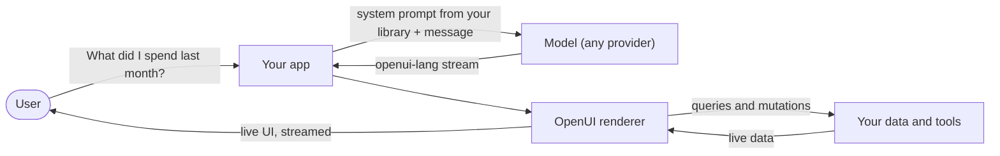
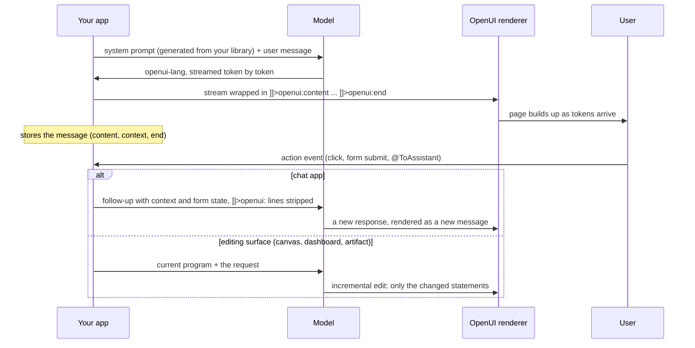

# OpenUI Overview

**1.0**

The OpenUI specification is three documents:

- **overview.md** (this file): what OpenUI is, and a short tour of every feature with an example.
- **[language.md](./language.md)**: the exact rules of the language, for people who build parsers and renderers.
- **[prompt.md](./prompt.md)**: the LibrarySpec, the system prompt, and the message protocol.

This file explains. The other two define. Where they disagree, language.md and prompt.md are correct.

## What's new in 1.0

1.0 makes OpenUI ready for production. It adds a message protocol for streaming and storing responses, rules that keep stored UIs working as a library grows, and custom functions. It also brings a batch of fixes and small conveniences.

- **Message protocol.** One format for streamed and stored responses (section 4).
- **Production readiness.** Backward-compatibility rules for libraries (section 3), a LibrarySpec with `id` and `version`, a versioned system prompt, and conformance fixtures any client can test against.
- **Custom functions.** A library adds its own `@` functions, like `@Percent` (section 2.11).
- **Small conveniences.** `@Take` for top-N lists, single-step actions, and any value as `@ToAssistant` context.
- **Fixes.** One clear entry rule, streamed results that always match a full parse, edits that keep multi-line statements whole, and `===` read as `==`.

## 1. Introduction

### 1.1 What OpenUI is

OpenUI Lang is a compact, line-oriented language that a model writes to describe a user interface. It replaces JSON trees and raw HTML with a short program, one statement per line. The client renders the program while it streams in:

```openui-lang
root = Card([header, chart])
header = Header("Monthly Revenue", "Last 6 months")
chart = BarChart(labels, [series])
labels = ["Jan", "Feb", "Mar", "Apr", "May", "Jun"]
series = Series("Revenue", [12000, 15000, 14000, 18000, 21000, 25000])
```

Every line binds a name to a value. A name can be used before it is defined. The first line gives the shape of the page, and each later line fills it in.

### Quickstart

```tsx
import { generateSystemPrompt, Renderer } from "@openuidev/react-lang";
import { openuiLibrary, openuiPromptOptions } from "@openuidev/react-ui";

// Server: send this as the system prompt.
const systemPrompt = generateSystemPrompt({
  library: openuiLibrary.toSpec(),
  promptOptions: openuiPromptOptions,
});

// Client: render the model's text while it streams.
<Renderer library={openuiLibrary} response={text} isStreaming={isStreaming} />
```

The full walkthrough is the [docs quickstart](https://openui.com/docs/openui-lang/quickstart).

### 1.2 Design goals

- **Few tokens.** Positional arguments and short names keep programs small, up to 67% smaller than the same UI in JSON.
- **Streams by default.** Every partial program is a valid page, so the UI builds up as the model writes.
- **Forgiving.** A mistake removes the smallest broken piece. The rest of the page still renders.
- **Interactive without the model.** State, expressions, and actions run in the client, with no round trip to the model.
- **Your data stays yours.** The page reads and writes data through tools your app provides. Tool data never passes through the model.

### 1.3 The end-to-end flow


```mermaid
flowchart LR
    user([User]) -- "What did I spend last month?" --> app[Your app]
    app -- "system prompt from your library + message" --> llm["Model (any provider)"]
    llm -- "openui-lang stream" --> app
    app --> ren[OpenUI renderer]
    ren -- "live UI, streamed" --> user
    ren -- "queries and mutations" --> tools[Your data and tools]
    tools -- "live data" --> ren
```

Your app holds the data and the component library. The library generates a system prompt that teaches the model the language and your components. The model streams OpenUI Lang back, and the renderer draws it as it arrives. The page talks to your data through queries and mutations.

A turn looks like this:


```mermaid
sequenceDiagram
    participant App as Your app
    participant Model
    participant Renderer as OpenUI renderer
    participant User
    App->>Model: system prompt (generated from your library) + user message
    Model->>App: openui-lang, streamed token by token
    App->>Renderer: stream wrapped in ]]>openui:content ... ]]>openui:end
    Renderer->>User: page builds up as tokens arrive
    Note over App: stores the message (content, context, end)
    User->>App: action event (click, form submit, @ToAssistant)
    alt chat app
        App->>Model: follow-up with context and form state, ]]>openui: lines stripped
        Model->>Renderer: a new response, rendered as a new message
    else editing surface (canvas, dashboard, artifact)
        App->>Model: current program + the request
        Model->>Renderer: incremental edit: only the changed statements
    end
```

The app wraps each response in `]]>openui:` lines and stores it that way (section 4). The model never sees those lines. In a chat app, a click becomes a new turn and the model answers with a new message. In an editing surface, the model answers with only the changed statements, and the client merges them into the live page (section 2.6).

## 2. Features

The features go from simple to advanced. Component names in the examples are illustrative: every library defines its own components. The exact rules are in language.md.

### 2.1 Components

The model builds UI from components you define. Arguments are positional, in the order the library lists the props. Say `Button` lists `label`, `action`, `variant`:

```openui-lang
btn = Button("Save changes", saveAction, "primary")
```

The renderer receives `{ label: "Save changes", action: saveAction, variant: "primary" }`. Optional arguments at the end can be left out. `null` skips an optional argument in the middle.

Rendering starts at the statement named `root`. Everything it reaches renders. A statement nothing reaches is not rendered.

If there is no `root`, the first statement is used when it calls the library's root component, with a warning. Otherwise nothing renders and the client reports `no-root` when the stream ends. Rules in language.md, section 2.2.

### 2.2 References and hoisting

A statement can use any other statement by name, wherever it appears:

```openui-lang
root = Card([title, kpis, refreshBtn])
title = Header("Support Overview")
kpis = Stack([openCount, closedCount])
openCount = Metric("Open", 12)
closedCount = Metric("Closed", 8)
refreshBtn = Button("Refresh")
```

The first line uses `title`, `kpis`, and `refreshBtn` before they exist. This is hoisting. It lets the model write the layout first and the data last.

A name with no statement yet is unresolved. That means "not yet", not "error": the `Stack` shows one metric until `closedCount` arrives. When two statements bind the same name, the later one wins. Rules in language.md, sections 2.3 and 2.4.

### 2.3 Streaming

The client parses and renders again on every chunk, so a half-received response is always a valid page:

| Arrived so far | On screen |
| --- | --- |
| `root = Card([header, chart])` | An empty card. |
| `header = Header("Monthly Rev` | A header reading "Monthly Rev", filling in as the model types. |
| `enue", "Last 6 months")` | The full header. |
| `chart = BarChart(labels, [series])` | An empty chart. |
| `labels = [...]`, `series = Series(...)` | The bars fill in. |

The parser closes open brackets and strings for you, so `root = Card([header` already renders an empty card. When the stream ends, the result is the same as parsing the full text at once. The host tells the client when the stream ends (in React, `isStreaming` turns false). Rules in language.md, section 4.

### 2.4 Actions

An action runs when the user clicks. A button can send a message back to the model or open a link:

```openui-lang
askBtn = Button("Explain this chart", @ToAssistant("Explain the revenue chart"))
docsBtn = Button("Docs", @OpenUrl("https://example.com/docs"))
```

`@ToAssistant` takes an optional second argument, `context`. It can be any value, and the host receives it unchanged:

```openui-lang
approveBtn = Button("Approve", @ToAssistant("Approve this order", { orderId: 42 }))
```

For more than one step, wrap them in `Action([...])`. Steps run in order:

```openui-lang
closeBtn = Button("Close ticket", Action([@Run(save), @Set($showModal, false), @ToAssistant("Ticket closed")]))
```

There are five steps: `@ToAssistant`, `@OpenUrl`, `@Set` and `@Reset` (for state, section 2.9), and `@Run` (for queries and mutations, section 2.10). A failed mutation stops the steps after it. Rules in language.md, section 6.3.

### 2.5 Forms and validation

Inputs carry validation rules as an object:

```openui-lang
email = Input("email", "you@company.com", "email", { required: true, email: true })
```

The renderer checks the rules, shows the messages, and blocks submit until they pass. The rules are `required`, `email`, `url`, `numeric`, `minLength`, `maxLength`, `min`, `max`, and `pattern`.

Inputs inside a form submit together. The form keeps each value under the input's `name`:

```openui-lang
contactForm = Form("contact", Buttons([submitBtn]), [nameField, emailField])
nameField = FormControl("Name", Input("name", "Your name", "text", { required: true }))
emailField = FormControl("Email", Input("email", "your@email.com", "email", { required: true, email: true }))
submitBtn = Button("Submit")
```

When a button sends a message, the form values go with it. (These examples use `Input(name, placeholder, type, rules, value)`. Your library's signatures may differ.) Rules in language.md, sections 5.3 and 5.4.

### 2.6 Incremental editing

To change a page, the model sends only the statements that change. The client merges them by name. The page showing:

```openui-lang
root = Card([header, chart])
header = Header("Monthly Revenue", "Last 6 months")
chart = BarChart(labels, [series])
labels = ["Jan", "Feb", "Mar", "Apr", "May", "Jun"]
series = Series("Revenue", [12000, 15000, 14000, 18000, 21000, 25000])
```

The user says "show it weekly". The model answers:

```openui-lang
header = Header("Weekly Revenue", "Last 4 weeks")
chart = BarChart(weekLabels, [series])
weekLabels = ["W1", "W2", "W3", "W4"]
series = Series("Revenue", [4800, 5300, 5100, 6200])
```

Named statements are replaced, new ones are added, and `root` stays. Nothing uses `labels` any more, so it is removed. `chart = null` would delete the chart. Rules in language.md, section 7.

### 2.7 Expressions

The language has arithmetic, comparison, logic, `? :`, member access, and indexing. The client evaluates them, so derived values update without the model:

```openui-lang
status = TextContent(total > 100000 ? "On track" : "Behind target")
share = @Round(part / total * 100, 1)
```

Member access on a list gives that field of every element: if `sales.rows` is a list of objects, `sales.rows.amount` is the list of their amounts. `===` and `!==` are read as `==` and `!=`. Rules in language.md, sections 1.5 and 3.2.

### 2.8 Built-in functions

Built-ins start with `@`:

- Aggregation: `@Count`, `@Sum`, `@Avg`, `@Min`, `@Max`, `@First`, `@Last`.
- Reshaping: `@Filter`, `@Sort`, `@Take`.
- Math: `@Round`, `@Abs`, `@Floor`, `@Ceil`.
- Iteration: `@Each`.

They nest, and they turn data into props:

```openui-lang
urgent = @Filter(tickets.rows, "priority", "==", "high")
topFive = @Take(@Sort(urgent, "createdAt", "desc"), 5)
rows = @Each(topFive, "t", Row(t.title, Tag(t.priority)))
```

`@Each(list, name, template)` builds the template once per element, with `name` bound to that element. Every built-in is defined in language.md, sections 3.4 and 3.5.

### 2.9 Reactive state

Variables that start with `$` hold state the user or an action changes: values bound to inputs, and values changed by `@Set` or `@Reset`. They tie components together: one component writes `$query`, others read it:

```openui-lang
$query = ""
search = Input("search", "Search tickets", "text", null, $query)
label = TextContent("Searching for " + $query)
```

Passing `$query` to an input binds it both ways. Typing updates `$query`, and everything that reads it updates too. The model writes this once, and the client runs it with no round trip:

```openui-lang
$tab = "overview"
picker = Select("tab", [SelectItem("overview", "Overview"), SelectItem("billing", "Billing")], null, null, $tab)
body = $tab == "overview" ? overviewPanel : billingPanel
```

Every value in a program updates when what it uses changes, not only `$` values. Tool data and derived values use plain names: `tickets = Query(...)`, `openCount = @Count(tickets.rows)`. A `$` variable with no declaration starts as `null`. Rules in language.md, section 5.

### 2.10 Queries and mutations

`Query` reads data from a tool your app provides. `Mutation` writes it. The model writes where the data comes from, and your backend supplies it:

```openui-lang
$days = "7"
data = Query("analytics", { days: $days }, { rows: [] })
filter = Select("days", [SelectItem("7", "7 days"), SelectItem("30", "30 days")], null, null, $days)
```

The arguments are the tool name, its arguments, and a default shown while loading. A `$variable` in the arguments makes the query fetch again when it changes. An optional fourth argument refreshes on a timer in seconds.

A mutation runs only when an action runs it:

```openui-lang
createResult = Mutation("create_ticket", { title: $title })
submitBtn = Button("Create", Action([@Run(createResult), @Run(tickets), @Reset($title)]))
```

A mutation result has `status` (`idle`, `loading`, `success`, `error`), `data`, and `error`, so the page can show progress. Name queries without `$`: `tickets = Query(...)`. A `$` name cannot read the result, and the client warns about it. Rules in language.md, section 6.

### 2.11 Custom functions

A library can add its own functions. The model calls them like built-ins:

```openui-lang
share = TextContent(@Percent(done, total))
```

The library declares each one with `defineFunction({ name, description, params, returns, fn })`. The program passes arguments by position, like components, and `fn` receives them as one object keyed by the `params` names. The prompt lists them next to the built-ins, and each client keeps the implementation. Functions are pure and synchronous: same inputs, same output, no side effects. A call to an unknown `@` name evaluates to null and reports `unknown-function`. Rules in language.md, section 3.6, and prompt.md, section 2.5.

### 2.12 Error recovery

Models make mistakes, so the client removes the smallest broken piece and renders the rest. It reports each problem with the statement, the problem, and a hint:

```json
{ "source": "parser", "code": "unknown-component", "statementId": "chart",
  "message": "Unknown component PieChart", "hint": "Available components: BarChart, LineChart, Table" }
```

Send the error back to the model, and it can answer with a one-line fix through incremental editing. Meanwhile the user sees the page with one chart missing, not a broken screen. The full error table is in language.md, section 8.2.

## 3. Keeping stored UIs working

A stored program has no prop names. `Button("Save", saveAction, "primary")` means what the prop order meant when it was written. Four rules keep stored programs rendering as a library changes:

1. **Add props only at the end** of a component's prop list.
2. **Never reorder or remove a prop.** Leave an unused prop in place and ignore it.
3. **A renamed component lists its old name in `aliases`**, so stored calls keep working. Props are positional, so a prop rename changes nothing.
4. **A new required prop needs a default**, because stored calls do not pass it.

Built-in names are reserved, so a library never uses a name like `@Take`. Each library has an `id` and a `version`. They are metadata and do not change parsing. The same rules for library authors are in prompt.md, section 3.2.

## 4. Streaming and storing responses

A response travels and is stored as plain text. The host wraps the program in a few lines of its own, each starting with `]]>openui:`:

```
]]>openui:content?library=support%401.2.0
root = Card([header, chart])
header = Header("Monthly Revenue", "Last 6 months")
]]>openui:context
{"formState": {"days": "30"}, "context": {"orderId": 42}}
]]>openui:end
```

- `content` holds the program (or prose).
- `context` holds JSON the host keeps with the message, such as form values and click data.
- `end` says the stream finished. A stored message without it was cut off.

The same format works while streaming and in storage. The model never writes or sees these lines: the host strips them before it sends history to the model and before it shows the message. prompt.md, section 6.3, gives the reference format for turning a click into the next user turn.

The renderer still holds live state while the page is open. The `context` section is how that state is saved: when a stored message is loaded again, the host reads `context` and gives the form values back to the renderer. The full protocol is in prompt.md, section 7.
