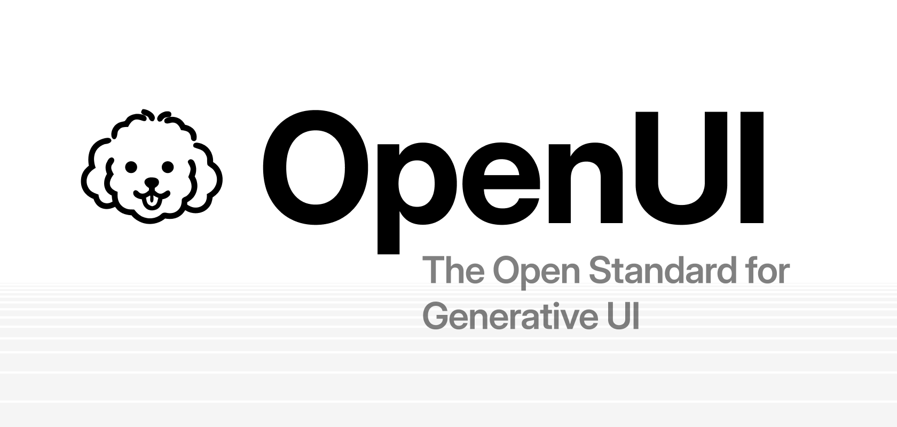
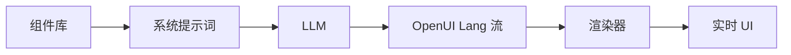

<div align="center">



# OpenUI —— 生成式 UI 的开放标准

[](https://github.com/thesysdev/openui/actions/workflows/build-js.yml)
[](./LICENSE)
[](https://discord.com/invite/Pbv5PsqUSv)

<a href="https://trendshift.io/repositories/22357" target="_blank"></a>

</div>


OpenUI 是一个全栈生成式 UI 框架——包含一种紧凑、以流式输出为优先的语言，一个内置组件库的 React 运行时，以及可直接使用的聊天界面；与 JSON 相比，最高可提升 67% 的 token 效率。


---


[文档](https://openui.com) · [Playground](https://www.openui.com/playground) · [示例聊天应用](../../examples/openui-chat) · [Discord](https://discord.com/invite/Pbv5PsqUSv) · [参与贡献](./CONTRIBUTING.md) · [行为准则](./CODE_OF_CONDUCT.md) · [安全](./SECURITY.md) · [许可证](../../LICENSE)


---

## 什么是 OpenUI

<div align="center">


</div>

OpenUI 的核心是 **OpenUI Lang**：一种紧凑、面向流式输出的语言，专为模型生成 UI 而设计。OpenUI 不再只把模型输出当作文本处理，而是让你定义组件、基于组件库生成提示词指令，并在模型流式输出的同时渲染结构化 UI。

**核心能力：**

- **OpenUI Lang** —— 一种用于结构化 UI 生成的紧凑语言，专为流式输出设计。
- <strong>内置组件库</strong> —— 图表、表单、表格、布局等，开箱即用，也可按需扩展。
- <strong>基于组件库生成提示词</strong> —— 直接从你允许使用的组件生成模型指令。
- <strong>流式渲染器</strong> —— 随着 token 到达，在 React 中渐进式解析并渲染模型输出。
- <strong>聊天与应用界面</strong> - 可将同一套基础能力用于助手、copilot 以及更广泛的交互式产品流程。


## 快速开始

```bash
npx @openuidev/cli@latest create --name genui-chat-app
cd genui-chat-app
echo "OPENAI_API_KEY=sk-your-key-here" > .env
npm run dev
```

这是开始使用 OpenUI 的最快方式。脚手架生成的应用为你提供了一个端到端的起点，内置流式处理、UI 组件和 OpenUI Lang 支持。

你将获得：

- **OpenUI Lang 支持** - 从一开始就在应用流程中内置结构化 UI 生成功能。
- <strong>库驱动的提示词</strong> - 根据你允许的组件集生成指令。
- <strong>流式支持</strong> - 在输出到达时渐进式更新 UI。
- <strong>可运行的应用基础</strong> - 从一个开箱即跑的示例开始，而不是手动把所有东西接起来。


## 工作原理

你的组件决定了模型可以生成什么。


1. 定义或复用一个组件库。
2. 基于该组件库生成 system prompt。
3. 将该 prompt 发送给你的模型。
4. 将 OpenUI Lang 的流式输出返回给客户端。
5. 使用 Renderer 渐进式渲染输出。

在 [Playground](https://www.openui.com/playground) 中亲自试试看——使用默认组件库实时生成 UI。

## 包

| Package | 描述 |
| :--- | :--- |
| [`@openuidev/react-lang`](../../packages/react-lang) | 核心运行时 —— 组件定义、解析器、渲染器、提示词生成 |
| [`@openuidev/react-headless`](../../packages/react-headless) | 无头聊天状态、流式适配器、消息格式转换器 |
| [`@openuidev/react-ui`](../../packages/react-ui) | 预构建的聊天布局和两个内置组件库 |
| [`@openuidev/cli`](../../packages/openui-cli) | 用于脚手架生成应用和生成 system prompt 的 CLI |

```bash
npm install @openuidev/react-lang @openuidev/react-ui
```

## 为什么选择 OpenUI Lang

OpenUI Lang 专为模型生成 UI 而设计，既要求结构化，也要求可流式传输。

- <strong>流式输出</strong> —— 随着 token 到达逐步输出 UI。
- **Token 效率** —— 相比等价 JSON，最多可减少 67% 的 token（见[基准测试](../../benchmarks)）。
- <strong>受控渲染</strong> —— 将输出限制在你定义并注册的组件范围内。
- <strong>类型化组件契约</strong> —— 通过 Zod schemas 预先定义组件 props 和结构。

### Token 效率基准测试

使用 `tiktoken`（GPT-5 encoder）测量。对比对象为 OpenUI Lang 与两种基于 JSON 的流式格式，覆盖七种 UI 场景：

| 场景               | Vercel JSON-Render | Thesys C1 JSON | OpenUI Lang |  相比 Vercel |   相比 C1 |
| ------------------ | -----------------: | -------------: | ----------: | -----------: | --------: |
| simple-table       |                340 |            357 |         148 |       -56.5% |    -58.5% |
| chart-with-data    |                520 |            516 |         231 |       -55.6% |    -55.2% |
| contact-form       |                893 |            849 |         294 |       -67.1% |    -65.4% |
| dashboard          |               2247 |           2261 |        1226 |       -45.4% |    -45.8% |
| pricing-page       |               2487 |           2379 |        1195 |       -52.0% |    -49.8% |
| settings-panel     |               1244 |           1205 |         540 |       -56.6% |    -55.2% |
| e-commerce-product |               2449 |           2381 |        1166 |       -52.4% |    -51.0% |
| <strong>总计</strong>           |          **10180** |       **9948** |    **4800** |     **-52.8%** | **-51.7%** |

完整方法说明和复现步骤见 [`benchmarks/`](../../benchmarks)。

## 文档

详细文档请访问 [openui.com](https://openui.com)。

## 仓库结构

```
openui/
├── packages/
│   ├── react-lang/       # Core runtime (parser, renderer, prompt generation)
│   ├── react-headless/   # Headless chat state & streaming adapters
│   ├── react-ui/         # Prebuilt chat layouts & component libraries
│   └── openui-cli/       # CLI for scaffolding & prompt generation
├── skills/
│   └── openui/           # Claude Code skill for AI-assisted development
├── examples/
│   └── openui-chat/      # Full working example app (Next.js)
├── docs/                 # Documentation site (openui.com)
└── benchmarks/           # Token efficiency benchmarks
```

推荐从以下内容开始：

- [openui.com](https://openui.com) 查看完整文档
- [`examples/openui-chat`](../../examples/openui-chat) 查看可运行示例应用
- 如果你想参与贡献，请查看 [`CONTRIBUTING.md`](./CONTRIBUTING.md)

## 社区

- [Discord](https://discord.com/invite/Pbv5PsqUSv) —— 提问、分享你正在构建的内容
- [GitHub Issues](https://github.com/thesysdev/openui/issues) —— 报告 bug 或提出功能请求


## 参与贡献

欢迎贡献。请查看 [`CONTRIBUTING.md`](./CONTRIBUTING.md) 了解贡献指南以及参与方式。

## Agent Skill
 
OpenUI 提供了一个 [Agent Skill](https://agentskills.io)，让 AI 编程助手（Claude Code、Codex、Cursor、Copilot 等）能够帮助你使用 OpenUI Lang 搭建、开发和调试生成式 UI 应用。
 
### 安装
 
```bash
# 使用 skills CLI（适用于所有代理）
npx skills add thesysdev/openui --skill openui
 
# 手动——复制到你的项目中
cp -r skills/openui .claude/skills/openui
```
 
该技能涵盖组件库设计、OpenUI Lang 语法、system prompt 生成、Renderer、SDK 包，以及对格式错误的 LLM 输出进行调试。

## 许可证

本项目按 [`LICENSE`](../../LICENSE) 中描述的条款提供。

---

<!-- CO-OP TRANSLATOR DISCLAIMER START -->
**免责声明**：
本文档已使用 AI 翻译服务 [Co-op Translator](https://github.com/Azure/co-op-translator) 进行翻译。尽管我们力求准确，但请注意，自动翻译可能包含错误或不准确之处。应以该文档原始语言版本为权威来源。对于关键信息，建议使用专业人工翻译。对于因使用本翻译而产生的任何误解或误释，我们概不负责。
<!-- CO-OP TRANSLATOR DISCLAIMER END -->